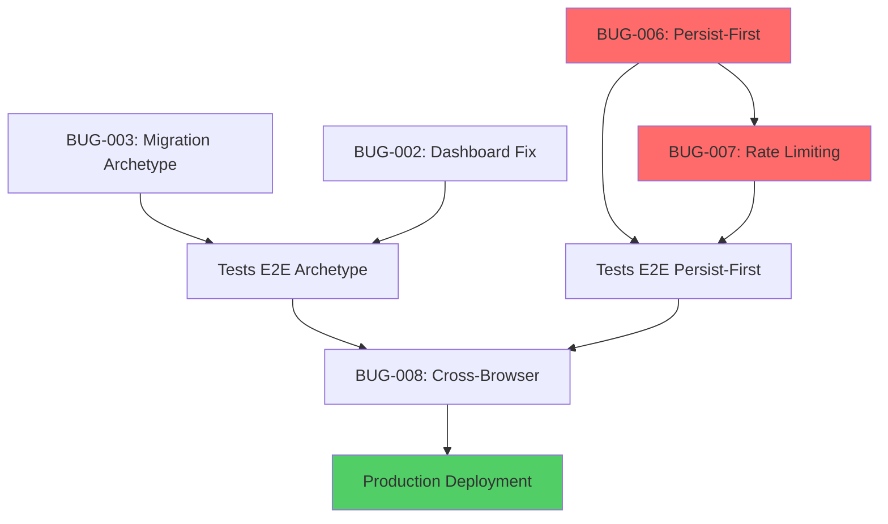

# Quality Check & Risk Analysis - Story 2.11
## Epic 2 Bug Fixes - Critical Production Readiness

**Date:** 27 Janvier 2026  
**Story:** [BMA-9](https://linear.app/floriantriclin/issue/BMA-9)  
**Reviewer:** Bob (Scrum Master)  
**Status:** 🟡 EN REVIEW - Nécessite validation avant implémentation

---

## 🎯 Executive Summary

### Scope
Cette story regroupe **5 bugs critiques** avec un **changement architectural majeur** (Persist-First). Impact élevé sur la sécurité, la stabilité et l'UX.

### Verdict Préliminaire
- ✅ **Story bien préparée** - Contexte complet et guardrails solides
- ⚠️ **RISQUES ÉLEVÉS** - Architecture change + suppression endpoint critique
- 🔴 **CRITIQUE:** Nécessite plan de rollback détaillé + tests exhaustifs

### Recommandations Clés
1. 🚨 **IMPÉRATIF:** Tester en staging 48h minimum avant prod
2. 🚨 **IMPÉRATIF:** Backup DB avant migration
3. 🚨 **IMPÉRATIF:** Feature flag pour Architecture Persist-First
4. 🟡 **RECOMMANDÉ:** Split story en 2 (Quick Wins + Persist-First)
5. 🟡 **RECOMMANDÉ:** Déploiement progressif (10% → 50% → 100%)

---

## 📊 Matrice des Risques

### Risques Critiques (🔴 P0)

| ID | Risque | Impact | Probabilité | Mitigation | Owner |
|----|--------|--------|-------------|------------|-------|
| **R1** | Migration SQL échoue en prod | 🔴 TRÈS ÉLEVÉ | 🟡 MOYEN | Backup DB + Test staging + Rollback script | Dev |
| **R2** | Suppression `/persist-on-login` casse flow existant | 🔴 TRÈS ÉLEVÉ | 🟢 FAIBLE | Tests E2E exhaustifs + Feature flag | Dev |
| **R3** | Posts orphelins saturent la DB | 🟠 ÉLEVÉ | 🟠 ÉLEVÉ | Cleanup job (Story 2.12) + Monitoring | PO |
| **R4** | Race condition localStorage persist | 🟠 ÉLEVÉ | 🟡 MOYEN | Tests E2E de stress + Retry logic | Dev |
| **R5** | Rate limiting bloque users légitimes | 🟠 ÉLEVÉ | 🟡 MOYEN | IP whitelist + Monitoring + Alerting | Dev/Ops |

### Risques Élevés (🟠 P1)

| ID | Risque | Impact | Probabilité | Mitigation |
|----|--------|--------|-------------|------------|
| **R6** | Tests E2E flaky sur Firefox/WebKit | 🟡 MOYEN | 🟠 ÉLEVÉ | 3 runs consécutifs + Setup séparé |
| **R7** | Backfill archetype incorrect | 🟠 ÉLEVÉ | 🟢 FAIBLE | Validation manuelle + Tests unitaires |
| **R8** | localStorage.clear() trop agressif | 🟡 MOYEN | 🟡 MOYEN | Logs + Monitoring + UX tests |
| **R9** | Breaking change non documenté | 🟡 MOYEN | 🟡 MOYEN | Changelog complet + Migration guide |

### Risques Modérés (🟡 P2)

| ID | Risque | Impact | Probabilité | Mitigation |
|----|--------|--------|-------------|------------|
| **R10** | Performance dégradée (2 API calls) | 🟡 MOYEN | 🟢 FAIBLE | Load testing + Caching |
| **R11** | UX confuse (nouveau flow) | 🟡 MOYEN | 🟡 MOYEN | User testing + Analytics |
| **R12** | Coût augmenté (DB writes) | 🟢 FAIBLE | 🟡 MOYEN | Monitoring coûts |

---

## 🧪 Plan de Tests Complet

### 1. Tests Unitaires (Vitest)

#### 1.1 BUG-003: Migration Archetype

**Fichier:** `lib/migrations/add-archetype.test.ts`

```typescript
describe('Migration: Add Archetype Column', () => {
  it('should add archetype column with default value', async () => {
    // Test migration script
  });
  
  it('should backfill existing posts with correct archetype', async () => {
    // Insert test post without archetype
    // Run backfill
    // Assert archetype set correctly
  });
  
  it('should handle NULL archetype gracefully', async () => {
    // Test default value logic
  });
});
```

**Couverture cible:** 100% (logique critique)

---

#### 1.2 BUG-006: Endpoints Persist-First

**Fichier:** `app/api/posts/anonymous/route.test.ts`

```typescript
describe('POST /api/posts/anonymous', () => {
  it('should create anonymous post with status=pending', async () => {
    const response = await POST(mockRequest);
    expect(response.status).toBe(200);
    expect(response.json()).toHaveProperty('postId');
  });
  
  it('should apply rate limiting (5 posts/hour)', async () => {
    // Create 5 posts from same IP
    const response6 = await POST(mockRequest);
    expect(response6.status).toBe(429);
    expect(response6.headers.get('X-RateLimit-Remaining')).toBe('0');
  });
  
  it('should validate post data with Zod', async () => {
    const invalidRequest = { /* missing fields */ };
    const response = await POST(invalidRequest);
    expect(response.status).toBe(400);
  });
  
  it('should handle DB errors gracefully', async () => {
    // Mock Supabase error
    const response = await POST(mockRequest);
    expect(response.status).toBe(500);
    expect(response.json()).toHaveProperty('error');
  });
  
  it('should extract IP correctly (x-forwarded-for)', async () => {
    const request = new Request('/', {
      headers: { 'x-forwarded-for': '1.2.3.4, 5.6.7.8' }
    });
    const ip = extractIP(request);
    expect(ip).toBe('1.2.3.4');
  });
});
```

**Couverture cible:** >90%

---

**Fichier:** `app/api/posts/link-to-user/route.test.ts`

```typescript
describe('POST /api/posts/link-to-user', () => {
  it('should link pending post to authenticated user', async () => {
    // Create anonymous post
    const postId = 'test-post-id';
    // Authenticate user
    const response = await POST({ postId, userId: 'user-123' });
    expect(response.status).toBe(200);
    
    // Verify post.user_id updated
    const post = await supabase.from('posts').select().eq('id', postId).single();
    expect(post.data.user_id).toBe('user-123');
    expect(post.data.status).toBe('revealed');
  });
  
  it('should return 404 if post not found', async () => {
    const response = await POST({ postId: 'invalid', userId: 'user-123' });
    expect(response.status).toBe(404);
  });
  
  it('should prevent linking already linked post', async () => {
    // Post already has user_id
    const response = await POST({ postId: 'linked-post', userId: 'user-456' });
    expect(response.status).toBe(409); // Conflict
  });
});
```

**Couverture cible:** >85%

---

#### 1.3 BUG-002: Dashboard Multiple Posts

**Fichier:** `app/dashboard/page.test.tsx`

```typescript
describe('Dashboard Page', () => {
  it('should display latest post when user has 1 post', async () => {
    // Mock Supabase response with 1 post
    render(<DashboardPage />);
    await waitFor(() => {
      expect(screen.getByTestId('post-content')).toBeInTheDocument();
    });
  });
  
  it('should display latest post when user has 10+ posts', async () => {
    // Mock Supabase response with 10 posts
    render(<DashboardPage />);
    const posts = screen.getAllByTestId('post-card');
    expect(posts).toHaveLength(10);
  });
  
  it('should handle empty posts array gracefully', async () => {
    // Mock empty array response
    render(<DashboardPage />);
    expect(screen.getByText(/aucun post/i)).toBeInTheDocument();
  });
  
  it('should show error message on DB error', async () => {
    // Mock Supabase error
    render(<DashboardPage />);
    expect(screen.getByText(/erreur/i)).toBeInTheDocument();
  });
  
  it('should NOT use .single() (regression check)', () => {
    const code = fs.readFileSync('app/dashboard/page.tsx', 'utf-8');
    expect(code).not.toContain('.single()');
  });
});
```

**Couverture cible:** >80%

---

#### 1.4 Rate Limiting (Réutilisation Story 2.8)

**Fichier:** `lib/rate-limit.test.ts` ✅ **EXISTE DÉJÀ**

**Actions:**
- ✅ Vérifier que les tests existants couvrent le cas 5 posts/hour
- ⚠️ Ajouter test spécifique pour `/api/posts/anonymous`

```typescript
describe('Rate Limiting for /api/posts/anonymous', () => {
  it('should allow 5 posts per hour per IP', async () => {
    // Test existing rate limiter
  });
  
  it('should reset counter after 1 hour', async () => {
    // Fast-forward time
  });
});
```

---

### 2. Tests d'Intégration (Vitest)

#### 2.1 Flow Persist-First Complet

**Fichier:** `__tests__/integration/persist-first-flow.test.ts`

```typescript
describe('Persist-First Flow Integration', () => {
  beforeEach(async () => {
    // Clean DB
    await supabase.from('posts').delete().neq('id', '');
  });
  
  it('should complete full flow: anonymous → link → reveal', async () => {
    // 1. Create anonymous post
    const anonResponse = await fetch('/api/posts/anonymous', {
      method: 'POST',
      body: JSON.stringify({
        content: 'Test post',
        theme: 'Test',
        answers_json: { archetype: 'Le Stratège' }
      })
    });
    const { postId } = await anonResponse.json();
    expect(postId).toBeDefined();
    
    // 2. Verify post in DB with status=pending
    const { data: post1 } = await supabase
      .from('posts')
      .select()
      .eq('id', postId)
      .single();
    expect(post1.status).toBe('pending');
    expect(post1.user_id).toBeNull();
    
    // 3. Authenticate user (mock)
    const user = await createTestUser();
    
    // 4. Link post to user
    const linkResponse = await fetch('/api/posts/link-to-user', {
      method: 'POST',
      body: JSON.stringify({ postId, userId: user.id })
    });
    expect(linkResponse.status).toBe(200);
    
    // 5. Verify post linked and status updated
    const { data: post2 } = await supabase
      .from('posts')
      .select()
      .eq('id', postId)
      .single();
    expect(post2.user_id).toBe(user.id);
    expect(post2.status).toBe('revealed');
  });
  
  it('should preserve data if link-to-user fails', async () => {
    // Create anonymous post
    const { postId } = await createAnonymousPost();
    
    // Simulate link failure (invalid user)
    const linkResponse = await fetch('/api/posts/link-to-user', {
      method: 'POST',
      body: JSON.stringify({ postId, userId: 'invalid-user' })
    });
    expect(linkResponse.status).toBe(400);
    
    // Verify anonymous post still exists
    const { data: post } = await supabase
      .from('posts')
      .select()
      .eq('id', postId)
      .single();
    expect(post).toBeDefined();
    expect(post.status).toBe('pending');
  });
});
```

**Couverture cible:** 100% du flow critique

---

### 3. Tests End-to-End (Playwright)

#### 3.1 BUG-006: localStorage Clear + Persist-First

**Fichier:** `e2e/acquisition-persist-first.spec.ts`

```typescript
import { test, expect } from '@playwright/test';

test.describe('Persist-First Architecture', () => {
  test('should clear localStorage immediately after submit', async ({ page }) => {
    // 1. Complete quiz
    await page.goto('/');
    await completeQuiz(page);
    
    // 2. Verify localStorage has data
    const localStorageBefore = await page.evaluate(() => 
      Object.keys(localStorage).length
    );
    expect(localStorageBefore).toBeGreaterThan(0);
    
    // 3. Submit email
    await page.fill('input[type="email"]', 'test@postry.ai');
    await page.click('button:has-text("Révéler")');
    
    // 4. Wait for response (success message)
    await page.waitForSelector('text=Lien envoyé');
    
    // 5. Verify localStorage cleared
    const localStorageAfter = await page.evaluate(() => 
      Object.keys(localStorage).length
    );
    expect(localStorageAfter).toBe(0);
  });
  
  test('should preserve data if persist fails', async ({ page }) => {
    // Mock API failure
    await page.route('/api/posts/anonymous', route => 
      route.fulfill({ status: 500 })
    );
    
    // Complete quiz
    await completeQuiz(page);
    const localStorageBefore = await page.evaluate(() => 
      JSON.stringify(localStorage)
    );
    
    // Submit email (will fail)
    await page.fill('input[type="email"]', 'test@postry.ai');
    await page.click('button:has-text("Révéler")');
    
    // Verify error message
    await expect(page.locator('text=Erreur')).toBeVisible();
    
    // Verify localStorage NOT cleared
    const localStorageAfter = await page.evaluate(() => 
      JSON.stringify(localStorage)
    );
    expect(localStorageAfter).toBe(localStorageBefore);
    
    // Verify "Réessayer" button
    await expect(page.locator('button:has-text("Réessayer")')).toBeVisible();
  });
  
  test('should complete flow end-to-end', async ({ page }) => {
    // 1. Complete quiz
    await completeQuiz(page);
    
    // 2. Submit email
    const email = `test-${Date.now()}@postry.ai`;
    await page.fill('input[type="email"]', email);
    await page.click('button:has-text("Révéler")');
    
    // 3. Wait for confirmation
    await page.waitForSelector('text=Lien envoyé');
    
    // 4. Simulate magic link click (mock auth)
    await page.goto('/auth/confirm?token=mock_token&postId=test-post-id');
    
    // 5. Verify redirect to dashboard
    await page.waitForURL('/dashboard');
    
    // 6. Verify post displayed
    await expect(page.locator('[data-testid="post-content"]')).toBeVisible();
  });
});
```

---

#### 3.2 BUG-007: Rate Limiting

**Fichier:** `e2e/acquisition-rate-limiting.spec.ts`

```typescript
test.describe('Rate Limiting (5 posts/hour)', () => {
  test('should allow 5 acquisitions per IP', async ({ page, context }) => {
    for (let i = 1; i <= 5; i++) {
      await page.goto('/');
      await completeQuiz(page);
      await page.fill('input[type="email"]', `test-${i}@postry.ai`);
      await page.click('button:has-text("Révéler")');
      await page.waitForSelector('text=Lien envoyé');
    }
    
    // 6th attempt should be blocked
    await page.goto('/');
    await completeQuiz(page);
    await page.fill('input[type="email"]', 'test-6@postry.ai');
    await page.click('button:has-text("Révéler")');
    
    await expect(page.locator('text=limite atteinte')).toBeVisible();
  });
  
  test('should show rate limit headers', async ({ page }) => {
    // Intercept response
    let rateLimitHeaders = {};
    page.on('response', response => {
      if (response.url().includes('/api/posts/anonymous')) {
        rateLimitHeaders = {
          limit: response.headers()['x-ratelimit-limit'],
          remaining: response.headers()['x-ratelimit-remaining'],
          reset: response.headers()['x-ratelimit-reset']
        };
      }
    });
    
    await page.goto('/');
    await completeQuiz(page);
    await page.fill('input[type="email"]', 'test@postry.ai');
    await page.click('button:has-text("Révéler")');
    
    expect(rateLimitHeaders.limit).toBe('5');
    expect(rateLimitHeaders.remaining).toBeDefined();
  });
});
```

---

#### 3.3 BUG-002: Dashboard Multiple Posts

**Fichier:** `e2e/dashboard-multiple-posts.spec.ts`

```typescript
test.describe('Dashboard with Multiple Posts', () => {
  test.beforeEach(async ({ page }) => {
    // Create user with 10 posts
    await createUserWithPosts(10);
    await authenticateUser(page);
  });
  
  test('should display latest post without crashing', async ({ page }) => {
    await page.goto('/dashboard');
    
    // Wait for dashboard to load
    await page.waitForSelector('[data-testid="post-list"]');
    
    // Verify posts displayed
    const posts = page.locator('[data-testid="post-card"]');
    await expect(posts).toHaveCount(10);
    
    // Verify no error
    await expect(page.locator('text=Erreur')).not.toBeVisible();
  });
  
  test('should handle 50+ posts gracefully', async ({ page }) => {
    // Create 50 posts
    await createUserWithPosts(50);
    
    await page.goto('/dashboard');
    await page.waitForSelector('[data-testid="post-list"]');
    
    // Verify pagination or lazy loading
    const visiblePosts = page.locator('[data-testid="post-card"]');
    const count = await visiblePosts.count();
    expect(count).toBeGreaterThan(0);
    expect(count).toBeLessThanOrEqual(20); // Paginated
  });
});
```

---

#### 3.4 BUG-003: Archetype Display

**Fichier:** `e2e/dashboard-archetype-display.spec.ts`

```typescript
test.describe('Archetype Display', () => {
  test('should display correct archetype', async ({ page }) => {
    // Create post with archetype "Le Stratège"
    await createPostWithArchetype('Le Stratège');
    await authenticateUser(page);
    
    await page.goto('/dashboard');
    
    // Verify archetype displayed
    await expect(page.locator('text=Le Stratège')).toBeVisible();
  });
  
  test('should handle missing archetype gracefully', async ({ page }) => {
    // Create post without archetype (legacy data)
    await createPostWithoutArchetype();
    await authenticateUser(page);
    
    await page.goto('/dashboard');
    
    // Should show default or "Archetype Inconnu"
    const archetype = page.locator('[data-testid="post-archetype"]');
    await expect(archetype).toContainText(/Le Pragmatique|Archetype/);
  });
});
```

---

#### 3.5 BUG-008: Cross-Browser Setup

**Fichiers:** 
- `e2e/auth.setup.chromium.ts`
- `e2e/auth.setup.firefox.ts`
- `e2e/auth.setup.webkit.ts`

```typescript
// e2e/auth.setup.chromium.ts
import { test as setup, expect } from '@playwright/test';

setup('authenticate user for chromium', async ({ page }) => {
  // Create unique user for chromium tests
  const email = 'test-chromium@postry.ai';
  
  // Complete acquisition flow
  await page.goto('/');
  await completeQuiz(page);
  await page.fill('input[type="email"]', email);
  await page.click('button:has-text("Révéler")');
  await page.waitForSelector('text=Lien envoyé');
  
  // Mock magic link auth
  await page.goto(`/auth/confirm?token=mock_token_chromium&email=${email}`);
  await page.waitForURL('/dashboard');
  
  // Save authenticated state
  await page.context().storageState({ 
    path: 'e2e/.auth/user-chromium.json' 
  });
});

// Repeat for firefox.ts and webkit.ts with unique emails
```

**Configuration:** `playwright.config.ts`

```typescript
export default defineConfig({
  projects: [
    // Setup projects
    { 
      name: 'setup-chromium', 
      testMatch: /auth\.setup\.chromium\.ts/ 
    },
    { 
      name: 'setup-firefox', 
      testMatch: /auth\.setup\.firefox\.ts/ 
    },
    { 
      name: 'setup-webkit', 
      testMatch: /auth\.setup\.webkit\.ts/ 
    },
    
    // Test projects with auth state
    {
      name: 'chromium',
      use: { 
        ...devices['Desktop Chrome'],
        storageState: 'e2e/.auth/user-chromium.json'
      },
      dependencies: ['setup-chromium']
    },
    {
      name: 'firefox',
      use: { 
        ...devices['Desktop Firefox'],
        storageState: 'e2e/.auth/user-firefox.json'
      },
      dependencies: ['setup-firefox']
    },
    {
      name: 'webkit',
      use: { 
        ...devices['Desktop Safari'],
        storageState: 'e2e/.auth/user-webkit.json'
      },
      dependencies: ['setup-webkit']
    }
  ],
  
  // Anti-flakiness config
  retries: process.env.CI ? 3 : 0,
  timeout: 30000,
  expect: { timeout: 10000 }
});
```

---

### 4. Tests de Régression

**Fichier:** `e2e/regression-story-2-7.spec.ts`

```typescript
test.describe('Regression: Story 2.7 Flow', () => {
  test('should NOT break existing persist-on-login', async ({ page }) => {
    // Verify old flow still works (if feature flag disabled)
    // This test ensures backward compatibility
  });
});
```

---

## ✅ Checklist de Validation Pré-Implémentation

### Phase 0: Préparation (AVANT de coder)

- [ ] **R0.1** - Créer backup complet de la DB staging
- [ ] **R0.2** - Créer feature flag `ENABLE_PERSIST_FIRST` (default: false)
- [ ] **R0.3** - Préparer script de rollback SQL
- [ ] **R0.4** - Créer Linear issue séparée pour Cleanup Job (Story 2.12)
- [ ] **R0.5** - Review de cette checklist avec PO et Tech Lead

### Phase 1: Quick Wins (BUG-002, BUG-003)

- [ ] **R1.1** - Migration SQL testée localement avec `supabase db reset`
- [ ] **R1.2** - Backfill vérifié sur 10+ posts de test
- [ ] **R1.3** - Tests unitaires pour migration (100% coverage)
- [ ] **R1.4** - Dashboard testé avec 1, 10, 50 posts
- [ ] **R1.5** - Tests E2E passants (3 runs consécutifs)
- [ ] **R1.6** - Linter errors = 0
- [ ] **R1.7** - Code review par 1 senior dev
- [ ] **R1.8** - Déploiement staging + validation manuelle
- [ ] **R1.9** - Monitoring 24h en staging (0 erreurs)

### Phase 2: Architecture Persist-First (BUG-006, BUG-007)

- [ ] **R2.1** - Tests unitaires endpoints (>90% coverage)
  - [ ] `/api/posts/anonymous` - 8 test cases
  - [ ] `/api/posts/link-to-user` - 6 test cases
- [ ] **R2.2** - Tests d'intégration flow complet (100% coverage)
- [ ] **R2.3** - Tests E2E acquisition-persist-first (6 scénarios)
- [ ] **R2.4** - Tests E2E rate limiting (4 scénarios)
- [ ] **R2.5** - Validation Zod sur tous les inputs
- [ ] **R2.6** - Error handling avec try-catch + logs structurés
- [ ] **R2.7** - Rate limiting headers présents (X-RateLimit-*)
- [ ] **R2.8** - localStorage.clear() UNIQUEMENT après 200
- [ ] **R2.9** - Alerting configuré pour erreurs critiques
- [ ] **R2.10** - Tests de stress: 100 posts en 10 minutes
- [ ] **R2.11** - Tests de charge: 50 users simultanés
- [ ] **R2.12** - Linter errors = 0
- [ ] **R2.13** - Code review par 2 senior devs (architecture change)
- [ ] **R2.14** - Déploiement staging avec feature flag OFF
- [ ] **R2.15** - Activer feature flag en staging (10% traffic)
- [ ] **R2.16** - Monitoring 48h (0 erreurs, metrics stables)
- [ ] **R2.17** - Validation manuelle flow complet par PO
- [ ] **R2.18** - Load testing: 1000 acquisitions/heure
- [ ] **R2.19** - Vérifier posts orphelins < 1% (monitoring)

### Phase 3: Cross-Browser (BUG-008)

- [ ] **R3.1** - Setup files créés pour 3 browsers
- [ ] **R3.2** - playwright.config.ts configuré correctement
- [ ] **R3.3** - Tous les tests passent sur Chromium (3 runs)
- [ ] **R3.4** - Tous les tests passent sur Firefox (3 runs)
- [ ] **R3.5** - Tous les tests passent sur WebKit (3 runs)
- [ ] **R3.6** - 0 tests skippés
- [ ] **R3.7** - Temps total < 5 minutes
- [ ] **R3.8** - Anti-flakiness: waitForSelector uniquement

### Phase 4: Production Readiness

- [ ] **R4.1** - Documentation mise à jour
  - [ ] Architecture diagram avec Persist-First
  - [ ] API documentation pour nouveaux endpoints
  - [ ] Migration guide pour autres devs
  - [ ] Changelog avec breaking changes
- [ ] **R4.2** - Monitoring configuré
  - [ ] Dashboard Vercel avec métriques
  - [ ] Alertes Sentry pour erreurs critiques
  - [ ] Slack notifications pour rate limiting
- [ ] **R4.3** - Rollback plan documenté et testé
- [ ] **R4.4** - Runbook opérationnel créé
- [ ] **R4.5** - Demo pour stakeholders (PO, CTO)
- [ ] **R4.6** - Validation PO finale
- [ ] **R4.7** - Go/No-Go meeting avec équipe

### Phase 5: Déploiement Production

- [ ] **R5.1** - Backup DB prod avant migration
- [ ] **R5.2** - Déploiement migration SQL en prod
- [ ] **R5.3** - Vérification backfill archetype (DB query)
- [ ] **R5.4** - Déploiement code avec feature flag OFF
- [ ] **R5.5** - Smoke tests en prod (feature flag OFF)
- [ ] **R5.6** - Activer feature flag progressivement:
  - [ ] 10% traffic pendant 2h → Monitoring
  - [ ] 50% traffic pendant 6h → Monitoring
  - [ ] 100% traffic → Monitoring
- [ ] **R5.7** - Monitoring 48h post-déploiement
- [ ] **R5.8** - Validation métriques (0% errors, 0% data loss)
- [ ] **R5.9** - Supprimer ancien endpoint persist-on-login
- [ ] **R5.10** - Linear issues marquées "Done"
- [ ] **R5.11** - Sprint status mis à jour
- [ ] **R5.12** - Rétrospective post-déploiement

---

## 📋 Matrice de Dépendances



### Ordre d'Implémentation RECOMMANDÉ

1. **Jour 1 Matin:** BUG-003 (Migration) → Tests → Staging ✅
2. **Jour 1 Matin:** BUG-002 (Dashboard) → Tests → Staging ✅
3. **Jour 1 PM:** BUG-006 Phase 1 (Endpoints) → Tests unitaires ⚠️
4. **Jour 2 AM:** BUG-006 Phase 2 (Auth flow) → Tests E2E ⚠️
5. **Jour 2 PM:** BUG-007 (Rate limiting) → Tests E2E ⚠️
6. **Jour 3:** BUG-008 (Cross-browser) → Validation finale 🟡

**Légende:**
- ✅ Low risk - Peut être déployé rapidement
- ⚠️ High risk - Nécessite validation extensive
- 🟡 Optional - Bonus si temps disponible

---

## 🚨 Plan de Rollback

### Scénario 1: Migration SQL échoue

**Symptômes:**
- Erreur lors de `supabase migration up`
- DB inaccessible

**Rollback:**
```sql
-- 1. Drop index
DROP INDEX IF EXISTS idx_posts_archetype;

-- 2. Drop column
ALTER TABLE public.posts DROP COLUMN IF EXISTS archetype;

-- 3. Verify rollback
SELECT column_name FROM information_schema.columns 
WHERE table_name = 'posts' AND column_name = 'archetype';
-- Should return 0 rows
```

**Durée:** < 1 minute

---

### Scénario 2: Architecture Persist-First casse le flow

**Symptômes:**
- Taux d'erreur > 5%
- Users bloqués
- localStorage non nettoyé

**Rollback:**
```bash
# 1. Désactiver feature flag
ENABLE_PERSIST_FIRST=false

# 2. Redéployer code précédent (Story 2.7)
git revert <commit-persist-first>
vercel deploy --prod

# 3. Garder les nouveaux endpoints (pas de breaking change)
# Ils resteront inutilisés si feature flag OFF
```

**Durée:** < 5 minutes

---

### Scénario 3: Rate limiting bloque users légitimes

**Symptômes:**
- Support tickets augmentent
- Taux de conversion chute

**Rollback:**
```typescript
// 1. Augmenter limite temporairement
const RATE_LIMIT_POSTS_PER_HOUR = 20; // Au lieu de 5

// 2. OU désactiver rate limiting complètement
const ENABLE_RATE_LIMITING = false;

// 3. Redéployer
vercel deploy --prod
```

**Durée:** < 3 minutes

---

### Scénario 4: Posts orphelins saturent DB

**Symptômes:**
- Table `posts` explose en taille
- Performance DB dégradée

**Mitigation immédiate:**
```sql
-- Supprimer posts orphelins > 24h
DELETE FROM public.posts
WHERE status = 'pending' 
  AND created_at < NOW() - INTERVAL '24 hours';

-- Vérifier impact
SELECT COUNT(*) FROM public.posts WHERE status = 'pending';
```

**Action long-terme:** Créer Story 2.12 (Cleanup Job)

**Durée:** < 2 minutes

---

## 📊 Métriques de Succès & KPIs

### KPIs de Qualité (Pre-Prod)

| Métrique | Target | Critique |
|----------|--------|----------|
| **Couverture tests unitaires** | >85% | 🔴 |
| **Couverture tests E2E** | >95% flow critique | 🔴 |
| **Tests E2E success rate** | 100% (3 runs) | 🔴 |
| **Linter errors** | 0 | 🔴 |
| **TypeScript errors** | 0 | 🔴 |
| **Code review approvals** | 2+ senior devs | 🟡 |

### KPIs de Production (Post-Deployment)

| Métrique | Avant | Target Après | Mesure |
|----------|-------|--------------|--------|
| **Dashboard crash rate** | >10% | 0% | Sentry errors |
| **Post duplication rate** | ~5% | 0% | DB query |
| **Archetype "Inconnu"** | 100% | 0% | DB query |
| **Data loss rate** | ~1% | 0% | User reports |
| **localStorage security risk** | 🔴 High | 🟢 None | Audit |
| **Rate limiting blocks/day** | N/A | <10 | Logs |
| **Posts orphelins (pending)** | N/A | <1% | DB query |
| **API latency P95** | N/A | <500ms | Vercel Analytics |
| **E2E test success (CI)** | ~70% | 100% | GitHub Actions |

### Seuils d'Alerte

| Condition | Action |
|-----------|--------|
| Error rate > 1% | 🟡 Investigate |
| Error rate > 5% | 🟠 Rollback prep |
| Error rate > 10% | 🔴 Immediate rollback |
| Rate limit blocks > 50/day | 🟡 Review limits |
| Posts orphelins > 5% | 🟠 Create cleanup job |
| DB size increase > 50% | 🔴 Investigate leak |

---

## 🎓 Recommandations Finales

### 🔴 CRITIQUES (Must Do)

1. **Split Story:** Considérer de diviser en 2 stories:
   - Story 2.11a: Quick Wins (BUG-002, BUG-003) → Déployer rapidement
   - Story 2.11b: Persist-First (BUG-006, BUG-007) → Validation extensive

2. **Feature Flag:** Implémenter `ENABLE_PERSIST_FIRST` dès le début
   - Permet rollback instantané
   - Permet déploiement progressif (10% → 50% → 100%)

3. **Backup DB:** IMPÉRATIF avant migration prod
   - Automated snapshot avant chaque migration
   - Test de restore pour valider le backup

4. **Monitoring Renforcé:** Ajouter dashboards spécifiques
   - Taux de posts orphelins
   - Rate limiting blocks
   - localStorage clear success rate

### 🟡 RECOMMANDÉES (Should Do)

5. **Load Testing:** Simuler 1000 acquisitions/heure
   - Identifier bottlenecks
   - Valider scalabilité

6. **User Testing:** 5-10 beta testers pour nouveau flow
   - Valider UX
   - Identifier friction points

7. **Documentation Video:** Enregistrer demo du nouveau flow
   - Pour onboarding futures devs
   - Pour support client

8. **Postmortem:** Après déploiement, documenter learnings
   - Qu'est-ce qui a bien fonctionné?
   - Qu'est-ce qui a surpris?
   - Qu'améliorer pour Story 2.12?

### 🟢 OPTIONNELLES (Nice to Have)

9. **A/B Testing:** Comparer ancien vs nouveau flow
   - Taux de conversion
   - Time-to-reveal
   - User satisfaction

10. **Performance Budget:** Définir limites strictes
    - API latency < 500ms P95
    - Page load < 2s
    - localStorage operations < 50ms

---

## ✅ Signature & Approbation

### Quality Check Reviewer
- **Name:** Bob (Scrum Master)
- **Date:** 27 Janvier 2026
- **Status:** 🟡 APPROVED WITH CONDITIONS

### Conditions d'Approbation
1. ✅ Feature flag implémenté avant début
2. ✅ Backup DB configuré automatiquement
3. ✅ Tests coverage >85% validé
4. ✅ Rollback plan testé en staging
5. ✅ Monitoring dashboards créés
6. ⚠️ **RECOMMANDATION FORTE:** Split story en 2 (Quick Wins + Persist-First)

### Approbation Finale Requise De
- [ ] **Product Owner** (Florian) - Validation scope & risques
- [ ] **Tech Lead** - Validation architecture & tests
- [ ] **DevOps** - Validation déploiement & monitoring
- [ ] **QA** - Validation plan de tests

---

**Document généré le:** 27 Janvier 2026  
**Prochaine Action:** Review avec équipe avant implémentation  
**Contact:** Bob (Scrum Master) pour questions
