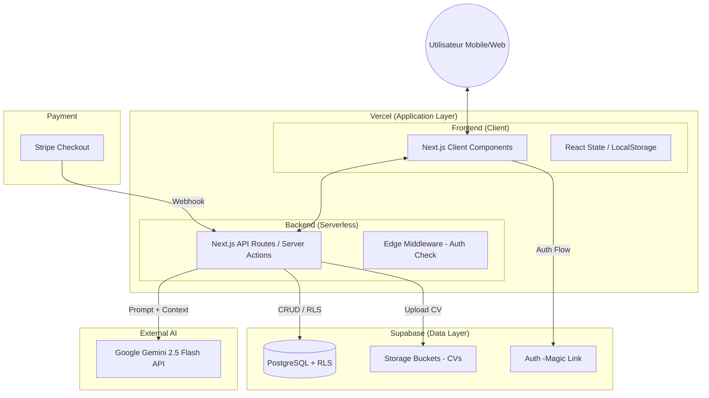

# 02. Architecture de Haut Niveau

## Résumé Technique

L'architecture de **postry.ai** est conçue comme une application **Fullstack Serverless** hébergée sur l'infrastructure Vercel (Edge Network), utilisant **Next.js 16** comme framework unifié pour le Frontend et l'API Backend. La persistance, l'identité et le stockage de fichiers sont délégués à **Supabase** (BaaS), tandis que l'intelligence est fournie par **Google Gemini 2.5 Flash** via des interactions stateless. Cette architecture privilégie la vélocité (Time-to-Market), la sécurité des données (RLS) et une séparation nette entre l'expérience utilisateur publique (Tunnel d'acquisition) et l'espace privé (Dashboard), le tout unifié par **TypeScript** de bout en bout.

## Choix de Plateforme et Infrastructure

Basé sur les exigences du PRD (Performance <15s, Sécurité des CVs, Vélocité) :

**Plateforme :** **Vercel + Supabase**

**Services Clés :**

- **Vercel :** Hosting Frontend, Serverless Functions (API Routes), Edge Middleware.
- **Supabase :** PostgreSQL (Base de données), GoTrue (Auth Magic Link), Storage (CVs), Vector (Optionnel futur).
- **Google Vertex AI / AI Studio :** API Gemini 2.5 Flash.
    
    **Régions de Déploiement :** iad1 (US East) ou cdg1 (Paris) - *Note : Il est crucial de colocaliser les Fonctions Vercel et l'instance Supabase dans la même région pour minimiser la latence.*
    

## Structure du Repository

**Structure :** **Monorepo (Intégré Next.js)**

**Outil :** NPM Workspaces ou simplement la structure native Next.js app/ pour le MVP.

**Organisation :**

Le code Frontend et Backend (API Routes/Server Actions) résidera dans le même dépôt pour partager les types TypeScript (DTOs) et assurer une cohérence totale entre l'UI et l'API.

## Diagramme d'Architecture de Haut Niveau

## Modèles Architecturaux (Patterns)

- **Architecture Serverless :** Utilisation exclusive de fonctions à la demande (Vercel Functions) pour le backend.
    - *Raisonnement :* Élimine la gestion de serveurs, s'aligne avec le trafic variable d'un lancement produit, et réduit les coûts fixes (Scale-to-Zero).
- **BFF (Backend for Frontend) via Next.js :** L'API Next.js agit comme un proxy sécurisé vers Gemini et Supabase.
    - *Raisonnement :* Permet de cacher les clés API (Gemini), de transformer les données pour l'UI, et d'injecter le contexte (CV) de manière sécurisée avant l'appel LLM.
- **Stateless Intelligence :** Chaque appel au LLM est indépendant et contient tout le contexte nécessaire.
    - *Raisonnement :* Simplifie l'architecture (pas de gestion complexe de "mémoire de conversation"), réduit les coûts de tokens, et améliore la robustesse.
- **Optimistic UI & Local First (Partiel) :** Pour le tunnel de Quiz.
    - *Raisonnement :* Les réponses au quiz sont stockées localement (Client State) jusqu'à la conversion, garantissant une fluidité maximale sans latence réseau à chaque clic.
