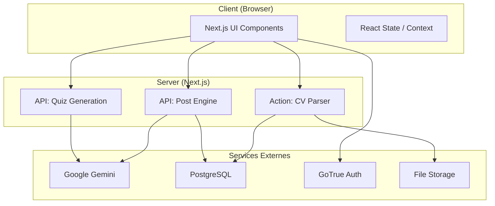

# 05. Composants

## Architecture des Composants (Frontend & Backend)

L'application est divisée en modules fonctionnels clairs, respectant la séparation des préoccupations (Separation of Concerns).

### 1. Module "Acquisition" (Tunnel Public)

- **Responsabilité :** Guider l'utilisateur anonyme de la Landing Page jusqu'à la génération floutée.
- **Composants Clés (Frontend) :**
    - LandingHero : Affiche la proposition de valeur et le bouton "Start".
    - QuizEngine : Orchestre l'affichage des questions et la capture des réponses (State Local).
    - TopicSelector : Input pour saisir le thème du post.
    - BlurredPreview : Affiche le résultat généré avec un filtre CSS flou et l'overlay de conversion.
- **Services Backend (API) :**
    - GET /api/quiz : Génère les questions dynamiques via Gemini.
    - POST /api/post/generate : Génère le post initial (mode anonyme).

### 2. Module "Identité & Sécurité" (Auth)

- **Responsabilité :** Gérer l'authentification, la création de compte, et la transition "Anonyme -> Authentifié".
- **Composants Clés (Frontend) :**
    - AuthModal : Formulaire de saisie email pour Magic Link.
    - AuthCallback : Page invisible gérant le retour du lien email et la création de session.
- **Services Backend (Supabase) :**
    - GoTrue Client : Gère l'envoi des emails et les tokens JWT.
    - Database Triggers : Initialise le profil public.users à la création du compte auth.users.

### 3. Module "Engagement" (Dashboard Privé)

- **Responsabilité :** Espace de travail de l'utilisateur pour voir, éditer et gérer ses posts.
- **Composants Clés (Frontend) :**
    - AppShell : Layout principal avec Sidebar et zone de contenu.
    - PostCard : Affiche le post final (net) avec options de copie.
    - EqualizerPanel : Contient les sliders (Ton, Longueur) pour modifier le post.
    - HistoryList : Liste cliquable des précédents posts.
- **Services Backend (API) :**
    - POST /api/post/regenerate : Régénère un post existant avec de nouveaux réglages (sans coûter de crédits).
    - GET /api/user/posts : Récupère l'historique (via SDK Supabase client).

### 4. Module "Expertise" (CV & Credits)

- **Responsabilité :** Gérer l'upload de CV, l'injection de contexte, et les quotas.
- **Composants Clés (Frontend) :**
    - CvUploader : Zone Drag & Drop avec feedback d'upload.
    - CreditCounter : Affiche le solde restant (ex: "2/5").
    - PaywallModal : Bloque l'action si quota = 0.
- **Services Backend (Server Actions) :**
    - uploadCV(formData) : Upload le fichier, parse le PDF, et met à jour le profil utilisateur.
    - checkQuota() : Middleware ou fonction utilitaire vérifiant les crédits avant génération.

## Diagramme de Composants (C4 Container - Simplifié)

