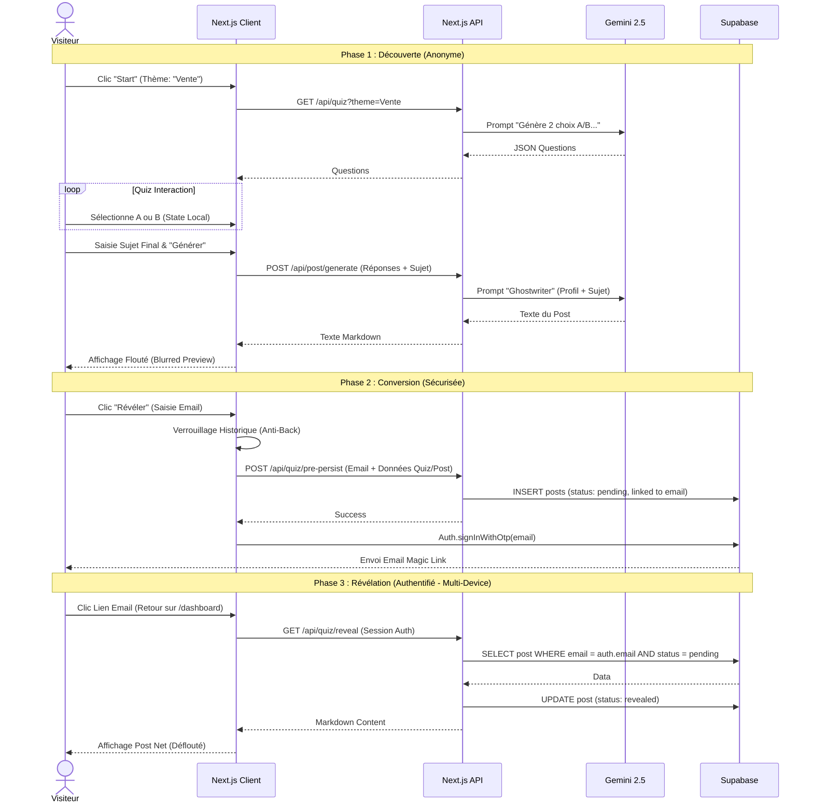
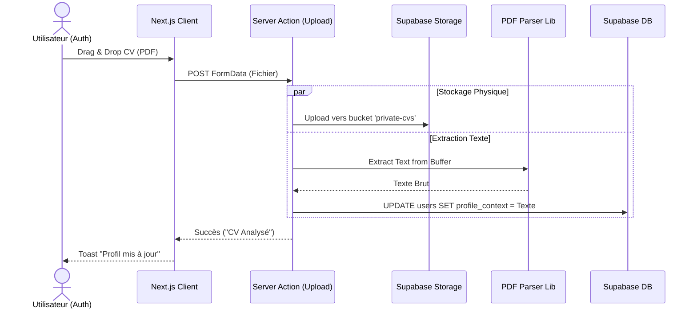

# 07. Flux de Travail Principaux

## Diagramme de Séquence : Tunnel d'Acquisition (Discovery -> Reveal)

Ce flux détaille le chemin critique de l'utilisateur anonyme jusqu'à la création de compte.

## Diagramme de Séquence : Upload et Analyse CV

Ce flux montre comment nous gérons les fichiers lourds et l'IA de manière asynchrone côté serveur.

