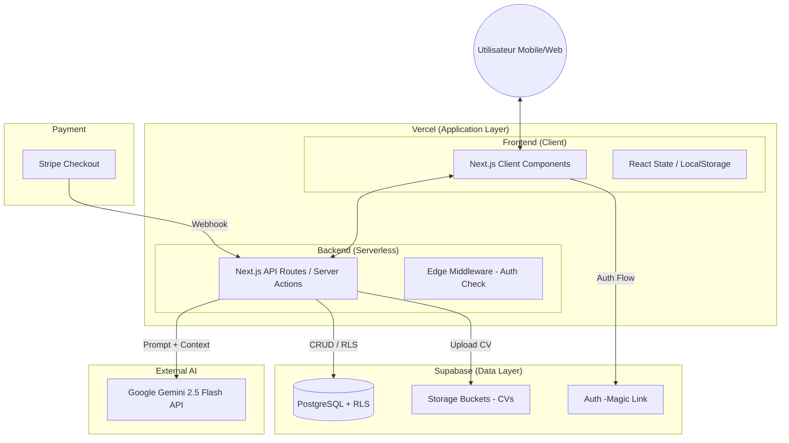
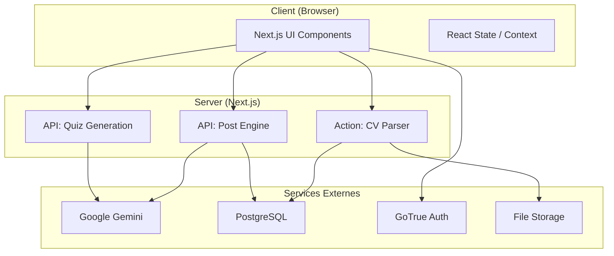
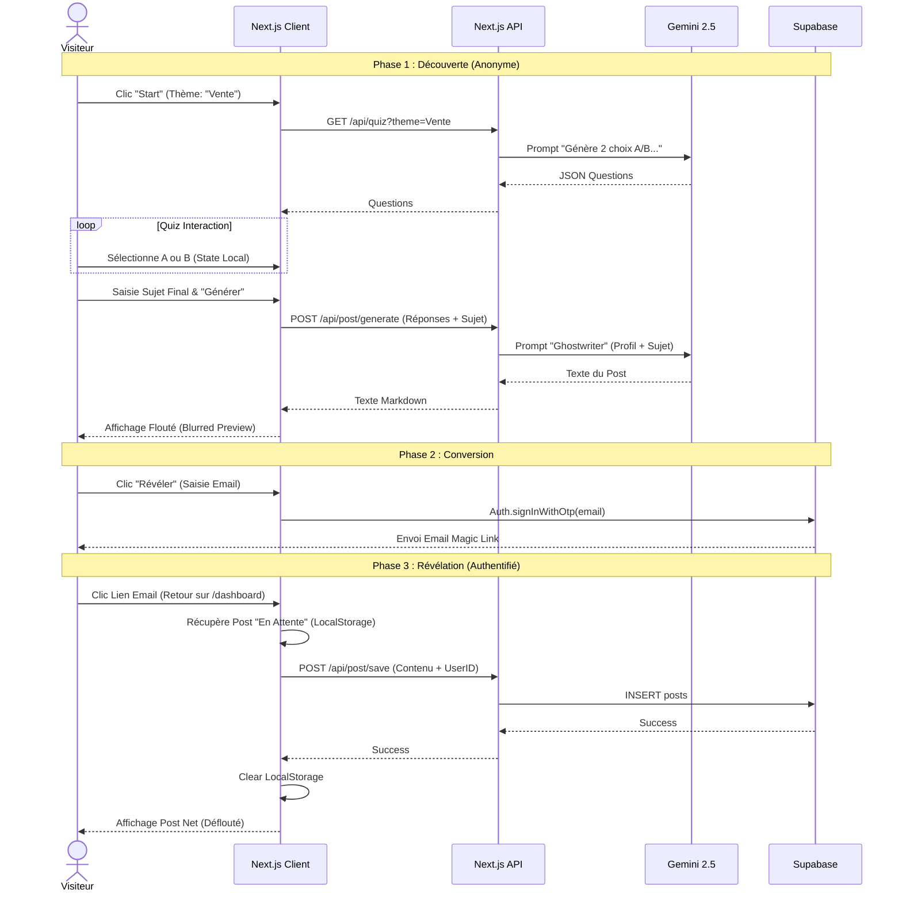
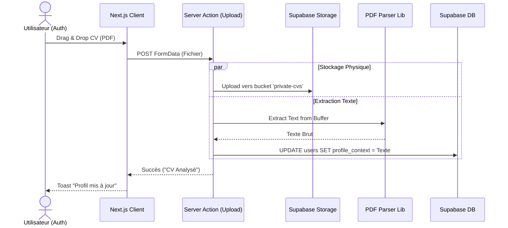

**Nom** : Architecture Fullstack

Nom de fichier : architecture.md

**Version :** 2.0

**Confidentialité :** Interne / Strict

**Objet :** Architecture du produit postry.ai

# Section 1 : Introduction

Ce document définit l'architecture technique complète pour **postry.ai**, englobant les systèmes backend (Next.js API/Serverless, Supabase), l'implémentation frontend (Next.js, Tailwind), et leur intégration. Il sert de source de vérité unique pour le développement piloté par l'IA (AI-driven development), garantissant une cohérence totale sur l'ensemble de la stack technologique.

Cette approche unifiée combine ce qui serait traditionnellement des documents d'architecture backend et frontend séparés, rationalisant le processus de développement pour cette application où l'expérience utilisateur ("Preuve Floutée") et la logique backend (Auth différée, Streaming LLM) sont intimement liées.

## Modèle de Démarrage (Starter Template)

*Analyse basée sur le PRD v3.0 :*

Le projet est un **Greenfield** (nouveau projet) mais avec des choix techniques forts qui s'apparentent à une stack moderne standardisée (T3 Stack ou similaire). Cependant, étant donné l'exigence d'un design "Brut" spécifique et d'une architecture "Stateless" pour le LLM, nous partirons d'une installation propre (Clean Slate) pour éviter la dette technique des boilerplates trop lourds.

**Décision :**

- **Type :** N/A - Projet Greenfield (Départ à zéro).
- **Justification :** Bien que des starters comme "Create T3 App" existent, le besoin spécifique d'une UI "Raw/Brut" (Tailwind sans composants pré-faits lourds) et l'intégration spécifique de Gemini via des routes API stateless justifient une configuration manuelle précise (npx create-next-app) pour une maîtrise totale du bundle.

## 1.3 Journal des Modifications (Change Log)

| **Date** | **Version** | **Description** | **Auteur** |
| --- | --- | --- | --- |
| 12/01/2026 | v1.0 | Architecture Initiale Fullstack (Greenfield MVP) | Winston (Architecte) |
| 13/01/2026 | v1.1 | Mise à jour suite nouveau PRD 2.0 | FTR |
| 15/01/2026 | v1.2 | Mise à jour OpenAI vers Gemini | FTR |
| 15/01/2026 | v2.0 | Refonte complète pour simplification | FTR |

# Section 2 : Architecture de Haut Niveau

## Résumé Technique

L'architecture de **postry.ai** est conçue comme une application **Fullstack Serverless** hébergée sur l'infrastructure Vercel (Edge Network), utilisant **Next.js 16** comme framework unifié pour le Frontend et l'API Backend. La persistance, l'identité et le stockage de fichiers sont délégués à **Supabase** (BaaS), tandis que l'intelligence est fournie par **Google Gemini 2.5 Flash** via des interactions stateless. Cette architecture privilégie la vélocité (Time-to-Market), la sécurité des données (RLS) et une séparation nette entre l'expérience utilisateur publique (Tunnel d'acquisition) et l'espace privé (Dashboard), le tout unifié par **TypeScript** de bout en bout.

## Choix de Plateforme et Infrastructure

Basé sur les exigences du PRD (Performance <15s, Sécurité des CVs, Vélocité) :

**Plateforme :** **Vercel + Supabase**

**Services Clés :**

- **Vercel :** Hosting Frontend, Serverless Functions (API Routes), Edge Middleware.
- **Supabase :** PostgreSQL (Base de données), GoTrue (Auth Magic Link), Storage (CVs), Vector (Optionnel futur).
- **Google Vertex AI / AI Studio :** API Gemini 2.5 Flash.
    
    **Régions de Déploiement :** iad1 (US East) ou cdg1 (Paris) - *Note : Il est crucial de colocaliser les Fonctions Vercel et l'instance Supabase dans la même région pour minimiser la latence.*
    

## Structure du Repository

**Structure :** **Monorepo (Intégré Next.js)**

**Outil :** NPM Workspaces ou simplement la structure native Next.js app/ pour le MVP.

**Organisation :**

Le code Frontend et Backend (API Routes/Server Actions) résidera dans le même dépôt pour partager les types TypeScript (DTOs) et assurer une cohérence totale entre l'UI et l'API.

## Diagramme d'Architecture de Haut Niveau



## Modèles Architecturaux (Patterns)

- **Architecture Serverless :** Utilisation exclusive de fonctions à la demande (Vercel Functions) pour le backend.
    - *Raisonnement :* Élimine la gestion de serveurs, s'aligne avec le trafic variable d'un lancement produit, et réduit les coûts fixes (Scale-to-Zero).
- **BFF (Backend for Frontend) via Next.js :** L'API Next.js agit comme un proxy sécurisé vers Gemini et Supabase.
    - *Raisonnement :* Permet de cacher les clés API (Gemini), de transformer les données pour l'UI, et d'injecter le contexte (CV) de manière sécurisée avant l'appel LLM.
- **Stateless Intelligence :** Chaque appel au LLM est indépendant et contient tout le contexte nécessaire.
    - *Raisonnement :* Simplifie l'architecture (pas de gestion complexe de "mémoire de conversation"), réduit les coûts de tokens, et améliore la robustesse.
- **Optimistic UI & Local First (Partiel) :** Pour le tunnel de Quiz.
    - *Raisonnement :* Les réponses au quiz sont stockées localement (Client State) jusqu'à la conversion, garantissant une fluidité maximale sans latence réseau à chaque clic.

# Section 3 : Stack Technique

## Tableau de la Stack Technologique

| **Catégorie** | **Technologie** | **Version** | **Objectif** | **Rationale (Justification)** |
| --- | --- | --- | --- | --- |
| **Frontend Framework** | **Next.js (App Router)** | **16.x** | Framework Fullstack | Standard industriel, SSR performant, intégration Vercel native, Server Actions simplifient les appels backend. |
| **Langage** | **TypeScript** | **5.x** | Langage Principal | Typage strict partagé entre Front et Back, réduit les bugs à l'exécution, auto-completion dans l'IDE. |
| **Styling** | **Tailwind CSS** | **4.x** | Moteur de Style | Permet le design "Brut" rapide sans runtime JS lourd. Classes utilitaires idéales pour le Mobile First. |
| **Icons** | **Lucide React** | **Dernière** | Iconographie | Légère, style "stroke" propre qui correspond à l'esthétique technique/brute visée. |
| **Base de Données** | **PostgreSQL (Supabase)** | **15+** | Persistance | Robustesse relationnelle, support natif JSONB (pour les réponses Quiz), et Row Level Security (RLS) pour la sécurité. |
| **Auth** | **Supabase Auth** | **Dernière** | Identité | Support natif du "Magic Link" (Passwordless) requis par le PRD, gestion de session sécurisée. |
| **AI Model** | **Google Gemini 2.5 Flash** | **Latest** | LLM | Vitesse extrême (<2s), coût très faible, et fenêtre de contexte suffisante pour ingérer un CV complet. |
| **Stockage Fichiers** | **Supabase Storage** | **-** | Stockage CVs | Buckets privés sécurisés, intégration directe avec l'Auth Supabase pour les droits d'accès. |
| **Parsing PDF** | **pdf-parse** | **1.1.1** | Extraction Texte | Librairie Node.js légère et éprouvée pour extraire du texte brut sans OCR complexe (suffisant pour MVP). |
| **Paiements** | **Stripe Checkout** | **Latest** | Monetisation | Page de paiement hébergée (Hosted UI) pour minimiser la conformité PCI et le code de gestion. |
| **État Global** | **React Context + Hooks** | **-** | State Management | Suffisant pour gérer l'état du Quiz et de l'Equalizer sans la complexité de Redux/Zustand. |
| **Validation** | **Zod** | **3.x** | Validation Données | Validation des schémas d'API et des formulaires, typage inféré automatiquement. |
| **Client HTTP** | **Fetch API (Native)** | **-** | Requêtes API | Pas besoin d'Axios, fetch est natif dans Next.js et supporte le caching/revalidation. |

## Choix d'Infrastructure Cloud

- **Fournisseur :** **Vercel** (Frontend + API) & **Supabase** (Data).
- **Services Clés :** Vercel Serverless Functions, Supabase Auth/DB/Storage.
- **Régions de Déploiement :**
    - Vercel : iad1 (US East) - *Recommandé pour la proximité avec la plupart des APIs AI.*
    - Supabase : us-east-1 (AWS) - *Doit matcher la région Vercel.*

# Section 4 : Modèles de Données

## Modèles Conceptuels

Nous avons besoin de stocker trois types d'entités principales :

1. **L'Utilisateur (User) :** Son identité, ses crédits, et son "Contexte CV" extrait.
2. **Le Post (Post) :** Le contenu généré, le thème, et les paramètres qui l'ont créé (pour l'historique).
3. **Le CV (Fichier) :** Le fichier physique stocké (via Supabase Storage, référencé implicitement).

## Schéma de Base de Données (PostgreSQL)

### 1. Table public.users

*Extension de la table système auth.users de Supabase via Trigger.*

| **Colonne** | **Type** | **Description** |
| --- | --- | --- |
| **id** | UUID | **Clé Primaire**. Référence étrangère vers auth.users.id. Assure que l'utilisateur DB correspond à l'utilisateur Auth. |
| email | TEXT | Email de l'utilisateur (copié de auth.users pour facilité d'accès). |
| credits_count | INTEGER | **Solde de crédits**. Défaut : 5. Décrémenté à chaque génération réussie (sauf régénération). |
| is_premium | BOOLEAN | **Statut abonné**. Défaut : FALSE. Passé à TRUE via Webhook Stripe. |
| profile_context | TEXT | **Texte brut extrait du CV**. Utilisé pour l'injection RAG dans le prompt LLM. Peut être NULL. |
| created_at | TIMESTAMPTZ | Date de création du compte. |

### 2. Table public.posts

| **Colonne** | **Type** | **Description** |
| --- | --- | --- |
| **id** | UUID | **Clé Primaire**. Générée automatiquement (gen_random_uuid()). |
| user_id | UUID | **Clé Étrangère**. Référence public.users.id. Lie le post à son créateur. |
| theme | TEXT | Le sujet saisi par l'utilisateur (ex: "L'échec"). |
| content | TEXT | Le contenu final généré en Markdown. |
| quiz_answers | JSONB | Stocke les réponses au quiz (Profilage). Ex: {"q1": "A", "archetype": "Visionnaire"}. |
| equalizer_settings | JSONB | Stocke les réglages de ton. Ex: {"tone": 20, "length": "short"}. |
| is_revealed | BOOLEAN | Défaut : FALSE. Passe à TRUE après l'auth (pour les posts générés anonymement puis réclamés). |
| created_at | TIMESTAMPTZ | Date de création. |

## Sécurité des Données (Row Level Security - RLS)

Supabase expose l'API directement, donc RLS est **critique**.

1. **Politique Users :**
    - SELECT : Un utilisateur ne peut voir QUE sa propre ligne (auth.uid() = id).
    - UPDATE : Un utilisateur ne peut modifier QUE sa propre ligne (ex: upload CV).
    - *Note :* credits_count et is_premium devraient idéalement être protégés contre l'écriture directe par l'utilisateur (via une fonction SECURITY DEFINER côté serveur) pour éviter la fraude.
2. **Politique Posts :**
    - ALL (Select, Insert, Update, Delete) : Autorisé uniquement si auth.uid() = user_id.
3. **Politique Storage (Bucket private-cvs) :**
    - INSERT : Autorisé pour auth.uid().
    - SELECT : Autorisé pour auth.uid().
    - Le bucket doit être configuré en mode **PRIVATE** (pas d'accès public URL).

# Section 5 : Composants

## Architecture des Composants (Frontend & Backend)

L'application est divisée en modules fonctionnels clairs, respectant la séparation des préoccupations (Separation of Concerns).

### 1. Module "Acquisition" (Tunnel Public)

- **Responsabilité :** Guider l'utilisateur anonyme de la Landing Page jusqu'à la génération floutée.
- **Composants Clés (Frontend) :**
    - LandingHero : Affiche la proposition de valeur et le bouton "Start".
    - QuizEngine : Orchestre l'affichage des questions et la capture des réponses (State Local).
    - TopicSelector : Input pour saisir le thème du post.
    - BlurredPreview : Affiche le résultat généré avec un filtre CSS flou et l'overlay de conversion.
- **Services Backend (API) :**
    - GET /api/quiz : Génère les questions dynamiques via Gemini.
    - POST /api/post/generate : Génère le post initial (mode anonyme).

### 2. Module "Identité & Sécurité" (Auth)

- **Responsabilité :** Gérer l'authentification, la création de compte, et la transition "Anonyme -> Authentifié".
- **Composants Clés (Frontend) :**
    - AuthModal : Formulaire de saisie email pour Magic Link.
    - AuthCallback : Page invisible gérant le retour du lien email et la création de session.
- **Services Backend (Supabase) :**
    - GoTrue Client : Gère l'envoi des emails et les tokens JWT.
    - Database Triggers : Initialise le profil public.users à la création du compte auth.users.

### 3. Module "Engagement" (Dashboard Privé)

- **Responsabilité :** Espace de travail de l'utilisateur pour voir, éditer et gérer ses posts.
- **Composants Clés (Frontend) :**
    - AppShell : Layout principal avec Sidebar et zone de contenu.
    - PostCard : Affiche le post final (net) avec options de copie.
    - EqualizerPanel : Contient les sliders (Ton, Longueur) pour modifier le post.
    - HistoryList : Liste cliquable des précédents posts.
- **Services Backend (API) :**
    - POST /api/post/regenerate : Régénère un post existant avec de nouveaux réglages (sans coûter de crédits).
    - GET /api/user/posts : Récupère l'historique (via SDK Supabase client).

### 4. Module "Expertise" (CV & Credits)

- **Responsabilité :** Gérer l'upload de CV, l'injection de contexte, et les quotas.
- **Composants Clés (Frontend) :**
    - CvUploader : Zone Drag & Drop avec feedback d'upload.
    - CreditCounter : Affiche le solde restant (ex: "2/5").
    - PaywallModal : Bloque l'action si quota = 0.
- **Services Backend (Server Actions) :**
    - uploadCV(formData) : Upload le fichier, parse le PDF, et met à jour le profil utilisateur.
    - checkQuota() : Middleware ou fonction utilitaire vérifiant les crédits avant génération.

## Diagramme de Composants (C4 Container - Simplifié)



# Section 6 : APIs Externes

## 1. Google Gemini API (Vertex AI / AI Studio)

- **Objectif :** Moteur d'intelligence (Génération Quiz, Rédaction Post, Analyse CV).
- **Modèle :** gemini-2.5-flash (ou équivalent stable/rapide).
- **Authentification :** Clé API Serveur (GEMINI_API_KEY) stockée dans les variables d'environnement. **Jamais exposée au client.**
- **Endpoints Clés Utilisés :**
    - POST /v1beta/models/gemini-2.5-flash:generateContent
- **Contraintes :**
    - Rate Limits (RPM) à surveiller selon le plan (Free vs Pay-as-you-go).
    - Gestion du contexte : Le CV complet est passé en texte dans le prompt à chaque requête (Stateless).

## 2. Stripe API (Checkout)

- **Objectif :** Gestion des paiements et abonnements (si applicable futur).
- **Service :** Stripe Checkout (Hosted Page).
- **Authentification :** Clé Secrète (STRIPE_SECRET_KEY) côté serveur. Clé Publique (NEXT_PUBLIC_STRIPE_KEY) côté client pour rediriger.
- **Flux :**
    1. Création de Session Checkout côté serveur.
    2. Redirection client vers URL Stripe.
    3. Webhook Stripe (checkout.session.completed) vers /api/webhooks/stripe pour débloquer les crédits.

## 3. Supabase API (via SDK Client & Admin)

- **Objectif :** Interface unifiée pour Auth, DB, et Storage.
- **Authentification :**
    - Client (Browser) : NEXT_PUBLIC_SUPABASE_ANON_KEY + Token JWT utilisateur (géré par le SDK).
    - Serveur (API Routes) : SUPABASE_SERVICE_ROLE_KEY (pour les tâches admin comme bypasser RLS ou gérer les utilisateurs).
- **Intégration :** Utilisation du package @supabase/ssr pour une gestion propre des cookies dans Next.js App Router.

# Section 7 : Flux de Travail Principaux

## Diagramme de Séquence : Tunnel d'Acquisition (Discovery -> Reveal)

Ce flux détaille le chemin critique de l'utilisateur anonyme jusqu'à la création de compte.



## Diagramme de Séquence : Upload et Analyse CV

Ce flux montre comment nous gérons les fichiers lourds et l'IA de manière asynchrone côté serveur.



# Section 8 : Schéma de Base de Données

## Script d'Initialisation SQL

Ce script configure les tables, les extensions, les triggers de sécurité et les politiques RLS.

codeSQL

```sql
-- 1. Activer les extensions nécessaires
create extension if not exists "uuid-ossp";

-- 2. Créer la table 'users' publique (Miroir de auth.users)
create table public.users (
  id uuid references auth.users not null primary key,
  email text,
  credits_count integer default 5,
  is_premium boolean default false,
  profile_context text, -- Texte extrait du CV
  created_at timestamptz default now()
);

-- Sécurité RLS pour 'users'
alter table public.users enable row level security;

create policy "Users can view own profile" 
on public.users for select 
using (auth.uid() = id);

create policy "Users can update own profile" 
on public.users for update 
using (auth.uid() = id);

-- 3. Trigger pour créer automatiquement le user public à l'inscription
create function public.handle_new_user() 
returns trigger as $$
begin
  insert into public.users (id, email)
  values (new.id, new.email);
  return new;
end;
$$ language plpgsql security definer;

create trigger on_auth_user_created
  after insert on auth.users
  for each row execute procedure public.handle_new_user();

-- 4. Créer la table 'posts'
create table public.posts (
  id uuid default uuid_generate_v4() primary key,
  user_id uuid references public.users(id) not null,
  theme text not null,
  content text not null, -- Markdown content
  quiz_answers jsonb, -- Réponses du profilage
  equalizer_settings jsonb, -- Réglages Ton/Longueur
  is_revealed boolean default false,
  created_at timestamptz default now()
);

-- Sécurité RLS pour 'posts'
alter table public.posts enable row level security;

create policy "Users can manage own posts" 
on public.posts for all 
using (auth.uid() = user_id);

-- 5. Configuration Storage (Buckets)
-- Note: À exécuter via l'interface Supabase ou API, mais voici la logique SQL sous-jacente
insert into storage.buckets (id, name, public) 
values ('private-cvs', 'private-cvs', false);

-- Politique Storage: Upload autorisé pour soi-même
create policy "Users can upload own CV"
on storage.objects for insert
with check (
  bucket_id = 'private-cvs' AND
  auth.uid() = owner
);

-- Politique Storage: Lecture autorisée pour soi-même
create policy "Users can read own CV"
on storage.objects for select
using (
  bucket_id = 'private-cvs' AND
  auth.uid() = owner
);
```

# Section 9 : Structure du Projet

## Arborescence de Fichiers (Next.js App Router)

Nous adoptons une structure orientée "Fonctionnalité" (Feature-based) compatible avec le App Router de Next.js 16.

codeCode

```
postry-ai/
├── .env.local                  # Secrets (Gemini Key, Supabase Keys)
├── .eslintrc.json              # Config Linter
├── next.config.mjs             # Config Next.js
├── package.json                # Dépendances
├── tailwind.config.ts          # Config Design System "Brut"
├── tsconfig.json               # Config TypeScript Strict
│
├── app/                        # Next.js App Router
│   ├── layout.tsx              # Root Layout (Font, Metadata)
│   ├── page.tsx                # Landing Page (Public)
│   │
│   ├── (auth)/                 # Route Group Auth (Layout isolé)
│   │   ├── auth/
│   │   │   └── callback/       # Route API pour Magic Link
│   │   │       └── route.ts
│   │   └── login/              # Page de Login (si accès direct)
│   │       └── page.tsx
│   │
│   ├── (dashboard)/            # Route Group App Privée
│   │   ├── layout.tsx          # App Shell (Sidebar, Auth Check)
│   │   ├── dashboard/          # Vue Principale
│   │   │   └── page.tsx
│   │   └── history/            # Vue Historique
│   │       └── page.tsx
│   │
│   ├── quiz/                   # Tunnel Public
│   │   └── page.tsx            # Quiz Interface
│   │
│   └── api/                    # API Routes (Backend Stateless)
│       ├── quiz/               # Génération Questions
│       │   └── route.ts
│       ├── post/               # Moteur de Génération
│       │   ├── generate/       # Création (Anonyme/Auth)
│       │   │   └── route.ts
│       │   └── regenerate/     # Equalizer Update
│       │       └── route.ts
│       └── webhooks/           # Stripe Webhooks
│           └── stripe/
│               └── route.ts
│
├── components/                 # Bibliothèque de Composants
│   ├── ui/                     # Atomes "Raw UI" (Button, Input)
│   │   ├── button.tsx
│   │   ├── input.tsx
│   │   ├── slider.tsx          # Equalizer component
│   │   └── card.tsx
│   ├── feature/                # Composants Métier
│   │   ├── quiz-engine.tsx     # Logique Quiz
│   │   ├── blurred-preview.tsx # Post Flouté + Overlay
│   │   ├── cv-uploader.tsx     # Drag & Drop Zone
│   │   └── equalizer-panel.tsx # Panneau de contrôle
│   └── layout/                 # Structure
│       ├── header.tsx
│       └── sidebar.tsx
│
├── lib/                        # Logique Partagée & Utils
│   ├── supabase/               # Clients Supabase
│   │   ├── client.ts           # Browser Client
│   │   └── server.ts           # Server Client (Cookie handling)
│   ├── gemini.ts               # SDK Wrapper Gemini
│   ├── stripe.ts               # SDK Wrapper Stripe
│   ├── utils.ts                # cn(), formatters
│   └── types.ts                # Types TypeScript partagés (DB + API)
│
├── actions/                    # Server Actions (Mutations)
│   ├── upload-cv.ts            # Gestion upload + parsing
│   └── save-post.ts            # Sauvegarde post anonyme -> user
│
└── public/                     # Assets statiques
    └── fonts/                  # Polices locales si nécessaire
```

# Section 10 : Infrastructure & Déploiement

## Stratégie de Déploiement (GitOps)

Nous utilisons le pipeline natif Vercel connecté à GitHub.

1. **Source :** GitHub Repository (main branch).
2. **Trigger :** Push sur main déclenche un déploiement Production. Push sur dev ou Pull Request déclenche un déploiement Preview.
3. **Build :** npm run build (Next.js build process).
4. **Output :** Edge Network (Statique + Serverless Functions).

## Variables d'Environnement (Secrets)

Ces variables doivent être configurées dans le dashboard Vercel (Project Settings > Environment Variables).

| **Variable** | **Environnement** | **Description** |
| --- | --- | --- |
| NEXT_PUBLIC_SUPABASE_URL | Prod / Preview / Dev | URL de l'instance Supabase. |
| NEXT_PUBLIC_SUPABASE_ANON_KEY | Prod / Preview / Dev | Clé publique Supabase (sûre pour le client). |
| SUPABASE_SERVICE_ROLE_KEY | Prod / Preview / Dev | **SECRET**. Clé admin pour les Server Actions privilégiées. |
| GEMINI_API_KEY | Prod / Preview / Dev | **SECRET**. Clé API Google AI Studio. |
| STRIPE_SECRET_KEY | Prod | **SECRET**. Clé privée Stripe (Live). |
| STRIPE_WEBHOOK_SECRET | Prod | **SECRET**. Pour vérifier la signature des webhooks. |
| NEXT_PUBLIC_STRIPE_KEY | Prod | Clé publique Stripe (Live). |
| NEXT_PUBLIC_BASE_URL | Prod | URL canonique (ex: https://postry.ai) pour les callbacks Auth. |

## Infrastructure as Code (IaC) - "ClickOps" pour MVP

Pour le MVP, nous ne mettons pas en place Terraform ou Pulumi. La configuration se fait via :

1. **Supabase :** Script SQL (Section 8) exécuté manuellement ou via CLI supabase db push.
2. **Vercel :** Interface Web pour connecter le repo.

## Stratégie de Rollback

- **Vercel :** Instant Rollback. En cas de bug critique en prod, un clic dans le dashboard Vercel permet de "Promote" le déploiement précédent instantanément.

# Section 11 : Stratégie de Gestion des Erreurs

## Approche Générale

Nous adoptons une stratégie défensive :

1. **Fail Gracefully :** L'interface ne doit jamais crasher blanc (White Screen of Death).
2. **User-Friendly Messages :** Traduire les erreurs techniques (500, 402) en messages humains ("Oups, nos serveurs surchauffent", "Quota épuisé").
3. **Logging Serveur :** Toutes les erreurs API/Server Action sont logguées (console Vercel pour le MVP).

## Patterns d'Erreur

### 1. Erreurs API (Backend)

Format de réponse standard JSON pour toutes les routes API :

```tsx
type ApiResponse<T> = 
  | { success: true; data: T }
  | { success: false; error: { code: string; message: string; details?: any } };
```

Codes d'erreur métier :

- QUOTA_EXCEEDED (402) : Plus de crédits. -> Déclenche la modal Paywall côté front.
- AUTH_REQUIRED (401) : Session invalide. -> Redirection vers Login.
- AI_SERVICE_UNAVAILABLE (503) : Gemini est down ou timeout. -> Retry automatique ou message "Réessayez".
- INVALID_INPUT (400) : Validation Zod échouée.

### 2. Erreurs Frontend (React)

- **Error Boundaries :** Envelopper les composants majeurs (QuizEngine, Dashboard) dans un Error Boundary React pour capturer les crashs JS et afficher une UI de secours ("Reload this section").
- **Toast Notifications :** Utilisation de sonner ou react-hot-toast pour afficher les erreurs transitoires (ex: "Upload échoué").

### 3. Erreurs Critiques (Sécurité)

- **Fuite de données :** Si une requête demande un post qui n'appartient pas à l'user -> 404 Not Found (plutôt que 403 Forbidden, pour ne pas révéler l'existence de la ressource).

## Logging & Monitoring

- **Logs :** console.error structuré côté serveur (Vercel Logs).
    - Format : [SERVICE] [ERROR_CODE] Message { meta }
    - Exemple : [GEMINI] [TIMEOUT] Failed to generate quiz for theme 'Sales' { duration: 15005ms }
- **Alerting (MVP) :** Pas de Sentry pour l'instant. Surveillance manuelle du dashboard Vercel en phase de lancement.

# Section 12 : Standards de Code

## Règles Critiques pour Agents IA

Ces instructions sont destinées à guider le Developer Agent lors de la génération de code :

1. **Strict Typing :** noImplicitAny est activé. Ne jamais utiliser any. Si un type est complexe, le définir dans lib/types.ts.
2. **Server Components par Défaut :** Dans app/, tous les composants sont Server Components par défaut. Ajouter 'use client' *uniquement* si le composant utilise des hooks (useState, useEffect) ou des event listeners (onClick).
    - *Exemple :* Page.tsx (Server) -> fetch data -> passe props à QuizClient.tsx (Client).
3. **Tailwind Arbitrary Values Interdites (sauf exception) :** Ne pas utiliser w-[123px]. Utiliser l'échelle standard w-32. Cela garantit la cohérence visuelle.
4. **Pas de Logique dans le JSX :** Extraire les logiques conditionnelles complexes dans des variables ou des fonctions avant le return.
    - *Mauvais :* { data && data.items.length > 0 && user.isPremium ? ... : ... }
    - *Bon :* if (!shouldShowItems) return null;
5. **Environment Variables Type-Safe :** Ne pas faire process.env.API_KEY. Créer un fichier lib/env.ts qui valide l'existence des variables au démarrage (avec zod ou simple check) et les exporte.

## Conventions de Nommage

| **Élément** | **Convention** | **Exemple** |
| --- | --- | --- |
| **Fichiers Composants** | Kebab-case | quiz-card.tsx |
| **Noms Composants** | PascalCase | QuizCard |
| **Fonctions / Variables** | camelCase | generateQuiz, isLoading |
| **Types / Interfaces** | PascalCase | UserProfile, QuizResponse |
| **Dossiers Routes** | Kebab-case | app/blog-posts/page.tsx |
| **Constantes** | SCREAMING_SNAKE | MAX_CREDITS_DEFAULT |

## Organisation des Tests (MVP)

- **Tests Unitaires :** Colocalisés avec le code si possible ou dans __tests__.
    - Focale : Fonctions utilitaires (lib/utils.ts), Parsers.
- **Tests E2E :** Pas de Cypress/Playwright pour le MVP (Vitesse > Couverture exhaustive initiale). On teste manuellement le "Happy Path".

## Gestion de Git

- **Commits :** Conventionnelle (ex: feat: add quiz engine, fix: typo in prompt).
- **Branches :** main (Prod), dev (Dev). Feature branches : feat/nom-feature.

# Section 13 : Stratégie de Test & Sécurité

## Stratégie de Test (MVP "Lean")

Nous n'avons pas le temps pour une couverture à 100%. Nous ciblons les zones critiques.

### 1. Tests Unitaires (Critiques Uniquement)

- **Outil :** Vitest (plus rapide que Jest).
- **Cible :**
    - lib/utils.ts : Fonctions de formatage.
    - actions/cv-parser.ts : Vérifier que l'extraction PDF retourne du texte propre (mock du buffer).
    - lib/credit-logic.ts : Vérifier que la décrémentation des crédits fonctionne et bloque à 0.

### 2. Tests d'Intégration (Manuels / Scriptés)

- **Cible :** Le flux "Quiz -> API Gemini -> JSON".
- **Méthode :** Script scripts/test-gemini.ts à lancer manuellement pour vérifier que Gemini répond bien au format JSON attendu (smoke test) sans lancer toute l'UI.

### 3. Tests UI (Manuels)

- **Cible :** Responsivité Mobile.
- **Méthode :** Vérification visuelle sur Chrome DevTools (mode Device) et sur un vrai smartphone avant chaque déploiement Prod.

## Sécurité (Security by Design)

### 1. Protection des Données (Privacy)

- **CVs :** Stockage dans un bucket privé. Accès via Signed URLs uniquement. RLS empêche l'accès aux autres users.
- **Prompts :** Les prompts système (System Instructions) ne sont jamais envoyés au client. Ils restent côté serveur (API Route). Cela protège la "Secret Sauce" du profilage psychologique.

### 2. Protection API

- **Rate Limiting :** Utilisation de @vercel/kv ou simple Map en mémoire (pour MVP) pour limiter les abus sur /api/post/generate par IP (ex: 10 requêtes / heure pour les anonymes).
- **Validation des Entrées :** Zod rejette tout JSON malformé ou trop volumineux avant même de traiter la demande.
- **CORS :** Configuré pour n'accepter que les requêtes venant de postry.ai (et localhost en dev).

### 3. Gestion des Secrets

- Les clés API (Gemini, Stripe, Supabase Service Role) ne sont *jamais* commitées dans Git (ajoutées au .gitignore).
- Scan de secrets via GitHub Advanced Security (si dispo) ou pre-commit hooks.

# Section 14 : Prochaines Étapes

## Plan d'Action Immédiat

L'architecture est définie. Voici les étapes séquentielles pour lancer le développement :

1. **Initialisation du Repo :**
    - Créer le projet Next.js (npx create-next-app).
    - Installer les dépendances (@supabase/ssr, lucide-react, zod, pdf-parse, google-generative-ai).
    - Configurer Tailwind et le linter.
2. **Mise en place Infrastructure :**
    - Créer le projet Supabase.
    - Exécuter le script SQL (Section 8) pour créer les tables.
    - Connecter le repo à Vercel et configurer les variables d'environnement.
3. **Développement Epic 1 (Acquisition) :**
    - Coder les composants UI "Brut" (components/ui).
    - Implémenter l'API Quiz (api/quiz/route.ts) connectée à Gemini.
    - Créer la page Landing et le flux Quiz -> Blurred Preview.
4. **Développement Epic 2 (Conversion) :**
    - Implémenter le flux Auth Magic Link.
    - Gérer la persistance "Anonyme -> Authentifié".
5. **Développement Epic 3 & 4 (Core Product) :**
    - Dashboard, Upload CV, et Intégration Stripe.

## Handoff aux Agents

Ce document sert de référence (Source of Truth).

- **Pour l'Architecte Frontend :** Utilisez la Section 9 (Structure) et 12 (Standards) pour générer les prompts de composants.
- **Pour le Développeur Backend :** Utilisez la Section 8 (SQL) et 6 (APIs) pour coder la logique serveur.
- **Pour le QA :** Utilisez la Section 13 (Tests) pour valider les livrables.

## Conclusion

L'architecture proposée pour **postry.ai** est **pragmatique, sécurisée et évolutive**. Elle évite la complexité inutile (pas de Docker, pas de Microservices, pas de Vector DB complexe) pour se concentrer sur la valeur utilisateur : une expérience fluide de découverte de soi via l'IA. La séparation nette entre le client (UI riche) et le serveur (Logique IA/Data) via Next.js garantit une maintenabilité à long terme.