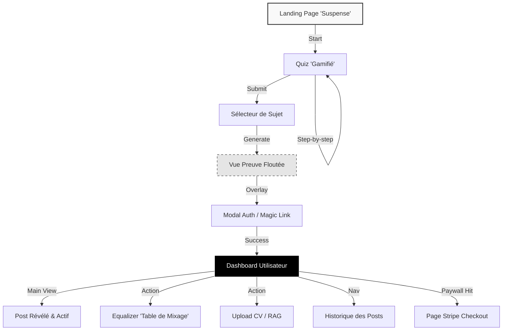
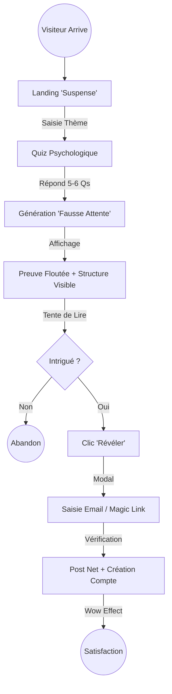

**Nom** : Spécification Front-End

Nom de fichier : front-end-spec.md

**Version :** 3.0

**Confidentialité :** Interne / Strict

**Objet :** Spécification du moteur de profilage stylistique et de l'algorithme de génération dynamique.

| **Version** | **Date** | **Auteur** | **Modifications / Notes** |
| --- | --- | --- | --- |
| 2.1 | 13/01/2026 | FTR | Version initiale |
| 3.0 | 15/01/2026 | FTR | Nouvelle version basée sur un nouveau PRD simplifié |

# Section 1 : Introduction & Objectifs UX

*Basé sur le PRD v3.0*

### **1.1 Introduction**

Ce document définit les objectifs d'expérience utilisateur, l'architecture de l'information, les parcours utilisateurs et les spécifications de design visuel pour **postry.ai**. Il sert de fondation pour le design visuel "Tech & Brut" et le développement frontend (Next.js/Tailwind), assurant une expérience cohérente qui privilégie la "Rugosité" et l'expression authentique par rapport au lissage générique des IA actuelles.

### **1.2 Objectifs UX & Principes**

**Personas Cibles :**

1. **Le Professionnel Sceptique :** Lassé des posts LinkedIn génériques style "ChatGPT". Il cherche de l'authenticité et est prêt à utiliser des outils plus "bruts" si le résultat résonne avec sa propre voix.
2. **Le Lead Curieux :** Attiré par l'accroche de la "Preuve Floutée". A besoin d'une gratification instantanée et d'une friction minimale pour convertir.

**Objectifs d'Utilisabilité :**

1. **Découverte Sans Friction :** Moins de 10 secondes pour charger et démarrer le Quiz.
2. **Contrôle Tangible :** L'"Equalizer" doit fournir un retour pseudo-haptique immédiat. Cela ne doit pas ressembler à un formulaire, mais à une table de mixage.
3. **Clarté Haut Contraste :** Malgré l'esthétique "Brut", la lisibilité du texte (WCAG AA) reste primordiale sur mobile.

**Principes de Design Cœurs :**

1. **Rugosité Visuelle :** Utilisation de grain, de bordures nettes, de polices monospace et d'un contraste élevé (Noir/Blanc) pour s'opposer à l'esthétique "lisse/corporate" des IA classiques.
2. **Logique de Révélation :** La transition de "Flou" (Blurred) à "Net" (Clear) est le moment "Aha!". Elle doit être dramatique visuellement.
3. **Mécanique Mobile-First :** Les interactions (sliders, boutons) sont dimensionnées pour les pouces. La navigation est linéaire (Tunnel) pour éviter l'abandon.
4. **Preuve avant Paiement :** La valeur est démontrée (via la structure/mise en page visible malgré le flou) avant que l'utilisateur ne soit sollicité (Email ou Argent).

# Section 2 : Architecture de l'Information (IA)

*Basé sur le PRD v3.0 - Focus Tunnel & Dashboard*

### **2.1 Plan du Site / Inventaire des Écrans**

L'architecture est divisée en deux zones distinctes : le **Tunnel d'Acquisition (Public)** et l'**Espace Utilisateur (Privé)**.

codeMermaid

### **2.2 Structure de Navigation**

**1. Navigation Publique (Tunnel) :**

- **Stratégie :** "Zéro Distraction". Aucun menu de navigation global.
- **Retour :** Uniquement un bouton "Retour" ou "Précédent" dans le Quiz pour modifier une réponse.
- **Objectif :** Guider l'utilisateur inexorablement vers la génération.

**2. Navigation Privée (Dashboard) :**

- **Mobile :** Header minimaliste (Logo + Menu Burger/User). Le menu ouvre un "Drawer" latéral contenant l'Historique et les Paramètres.
- **Desktop :** Sidebar latérale fixe à gauche contenant l'Historique (liste chronologique inverse) et le profil en bas.
- **Concept "Shell" :** L'application agit comme une coquille autour du contenu. Les outils (Equalizer) sont contextuels au post affiché.

---

### 🧠 Justification & Analyse (Rationale)

- **Choix du Tunnel Linéaire :** Pour l'acquisition, nous adoptons une approche radicale. Pas de page "À propos", pas de "Pricing" visible d'emblée. Le produit *est* le marketing. L'architecture reflète ce pari "Product-Led Growth".
- **Dualité Dashboard :** Le Dashboard doit gérer deux modes :
    - **Mode "Lecture" :** Le post est roi, centré, lisible.
    - **Mode "Édition" (Equalizer) :** Les contrôles apparaissent (bottom sheet sur mobile, panneau latéral sur desktop).
- **Hiérarchie de l'Historique :** L'historique n'est pas une page séparée, c'est un outil de navigation. Cliquer sur un ancien post le charge immédiatement dans la vue principale (Main View). Cela favorise la fluidité.

# Section 3 : Parcours Utilisateurs (User Flows)

*Basé sur le PRD v3.0 - Focus sur la Conversion et l'Engagement*

### **3.1 Flux Critique : De la Curiosité à la Révélation (Le Tunnel)**

Ce flux est le cœur de l'acquisition. Il doit transformer un visiteur anonyme en utilisateur inscrit.

- **Objectif Utilisateur :** "Je veux voir ce que l'IA peut écrire sur mon sujet avec mon style supposé."
- **Objectif Business :** Capturer l'email (Lead Magnet).

- **Points de Décision Clés :**
    - **Landing :** L'input du thème doit être engageant ("De quoi voulez-vous parler aujourd'hui ?").
    - **Quiz :** Les questions doivent être personnelles mais pas intrusives. La barre de progression doit avancer vite.
    - **Le Flou (The Blur) :** C'est le point de friction calculé. Si le flou est trop fort, on ne voit rien = pas de valeur perçue. Si trop faible, on peut lire sans payer (email).
    - **Réglage Recommandé :** blur-sm (4px) + opacité partielle sur le texte, mais titres/structure en gras bien visibles.

### **3.2 Flux d'Engagement : L'Equalizer (Raffinage)**

Ce flux fidélise l'utilisateur en lui donnant le contrôle (la "Rugosité").

- **Objectif Utilisateur :** "Ce n'est pas tout à fait ça. Je veux que ce soit plus incisif/court."
- **Trigger :** L'utilisateur est sur le Dashboard face à un post généré.
1. **Ouverture :** Utilisateur ouvre le panneau "Equalizer" (Icone sliders 🎚️).
2. **Ajustement :** Déplacement du slider "Ton" vers "Rugueux" (+20%).
3. **Feedback :** Le bouton "Régénérer" s'illumine ou pulse.
4. **Action :** Clic sur "Régénérer".
5. **Attente :** Animation de chargement "Tech" (ex: curseur clignotant, lignes de code qui défilent).
6. **Résultat :** Le nouveau texte remplace l'ancien avec une animation de fade-in. L'ancien est sauvegardé dans l'historique de version (si géré) ou remplacé.

# Section 4 : Wireframes & Maquettes (Layouts Clés - Révisé)

*Basé sur le nouveau flux : Landing -> Choix Thème -> Consignes & Loading -> Quiz A/B (Phase 1) -> Reveal Archétype -> Quiz Affinage (Phase 2) -> Reveal Final -> Génération Floutée*

### **4.1 Layouts d'Écrans Clés**

**A. Landing Page "Appel à l'Action"**

- **Hero Minimaliste :**
    - Titre H1 : "Trouvez votre Voix. Pas celle d'un Robot."
    - Sous-titre : "Découvrez votre Archétype d'écriture LinkedIn en 2 minutes."
    - **Action Principale :** Un bouton unique, central, massif : **[ DÉTERMINER MON STYLE ]**.
- **Pas d'input** sur cette page. L'engagement est un simple clic.

**B. Sélecteur de Thème (Pré-Jeu)**

- **Titre :** "Sur quel sujet êtes-vous le plus à l'aise ?"
- **Grille de Choix :** 10 tuiles sélectionnables (ex: "Management", "Vente", "Tech", "Entrepreneuriat", "Échec", etc.).
- **Comportement :** Sélection unique. Au clic sur une tuile -> Transition immédiate vers l'écran C.

**C. Consignes & Loading Masqué (Écran Tampon)**

- **Objectif UX :** Expliquer la règle tout en cachant le temps de génération (Appel API 1 - 6 questions).
- **Contenu Central :**
    - Icône ou visuel explicatif : "Duel A vs B".
    - Texte : "Nous allons vous proposer 2 phrases. Choisissez celle qui ressemble le plus à ce que *vous* auriez pu écrire."
    - Bouton : **[ C'EST PARTI ]** (Ce bouton n'apparaît ou ne devient actif que lorsque les questions sont prêtes/chargées en arrière-plan).

**D. Interface Quiz A/B (Phase 1 : 6 Questions)**

- **Layout Duel :**
    - Écran divisé en deux verticalement (ou deux grosses cartes l'une sous l'autre sur mobile).
    - **Option A** (Haut) vs **Option B** (Bas).
    - Contenu : Une phrase courte et typée pour chaque option.
- **Interaction :** Tap rapide. Pas de bouton "Suivant", le tap sur A ou B passe instantanément à la question suivante (Fluidité maximale type Tinder/Swipe).
- **Progression :** Indicateur discret "1/6".

**E. Premier Reveal (L'Archétype)**

- **Moment "Wow" :** Animation d'apparition du résultat.
- **Contenu :**
    - Grand Titre : Votre Archétype (ex: "Le Pragmatique", "Le Visionnaire").
    - Description courte : 2-3 lignes expliquant ce style.
    - **Background Process :** Pendant que l'utilisateur lit cet écran, l'IA génère les 5 questions de la Phase 2 (basées sur cet archétype).
- **Action :** Bouton **[ AFFINER MON PROFIL ]** (Pour "qualifier les zones d'ombre").

**F. Interface Quiz Affinage (Phase 2 : 5 Questions)**

- **Même layout que D**, mais les questions sont contextuelles, plus subtiles, visant à différencier des nuances (ex: Pragmatique "Bienveillant" vs Pragmatique "Direct").
- **Progression :** Indicateur "Precision : 80%..." qui monte à chaque réponse.

**G. Reveal Final & Input Sujet**

- **Résultat Final :**
    - Titre : Archétype + Adjectif (ex: "Le Pragmatique Bienveillant").
    - Radar Chart (Optionnel) : Visualisation rapide des axes.
- **Le "Call to Value" :**
    - Texte : "Voyons ce que ça donne en action."
    - **Input Texte :** "De quoi voulez-vous parler pour votre premier post ?" (Placeholder: "Ma dernière réussite...", "Une leçon apprise...").
    - Bouton : **[ GÉNÉRER MA SIGNATURE ]**.

**H. Vue "Preuve Floutée" (Génération Finale)**

- **Similaire à la version précédente :** Post généré, structure visible, texte flouté.
- **Overlay Conversion :** "Pour révéler votre post 'Pragmatique Bienveillant', créez votre compte."

# Section 5 : Bibliothèque de Composants / Design System

*Basé sur le PRD v3.0 - Spécifications "Tech & Brut" pour Tailwind*

Cette section définit les briques élémentaires pour le développement. Nous n'utilisons pas de librairie UI lourde (MUI, AntD), mais des composants atomiques construits avec Tailwind pour garantir le style unique.

### **5.1 Approche Design System : "Raw UI"**

- **Philosophie :** Pas d'effets de matière (ombres portées, dégradés complexes). Tout est plat, délimité par des bordures ou des contrastes forts.
- **Variable Clé :** border-width. Les bordures sont l'élément structurel principal.

### **5.2 Composants Cœurs (Core Components)**

**A. Boutons (Buttons)**

- **Primary (Action) :**
    - bg-black text-white border-2 border-black rounded-none
    - Hover: bg-zinc-800
    - Active: scale-[0.98] (Feedback mécanique)
    - Dimensions : h-12 (Mobile touch target safe)
- **Secondary (Choix/Option) :**
    - bg-white text-black border-2 border-black rounded-none
    - Hover: bg-zinc-100
    - Selected (Quiz) : bg-black text-white

**B. Inputs & Formulaires**

- **Text Input :**
    - bg-transparent border-b-2 border-black rounded-none px-0 py-2
    - Focus: outline-none border-b-4 (Épaississement de la ligne de base)
    - Font: font-mono (Style Terminal)
- **Sliders (Equalizer) :**
    - Track: h-1 bg-black
    - Thumb: w-6 h-6 bg-white border-2 border-black rounded-none shadow-none
    - Concept visuel : Ressemble à un fader de table de mixage vintage.

**C. Typographie & Texte**

- **Font Stack :**
    - Headings : Inter (Weight: 800/900) ou Chivo (Brut).
    - Body : Inter (Weight: 400/500).
    - Data/Meta/UI : JetBrains Mono ou Space Mono.
- **Hiérarchie :**
    - H1 : text-4xl font-black tracking-tight leading-none
    - Label : text-xs font-mono uppercase tracking-widest text-zinc-500

**D. Conteneurs & Cartes**

- **Card (Base) :**
    - bg-white border border-black p-6 (Pas de radius).
    - Optionnel : Effet "Stack" avec une ombre dure (box-shadow: 4px 4px 0px 0px #000).

### **5.3 Feedback & États**

- **Loading State (Squelette) :**
    - Pas de "Shimmer" (effet brillant) classique.
    - Utiliser des blocs clignotants (animate-pulse) noirs ou gris foncé pour un aspect plus "machine".
    - Ou un curseur clignotant _ en fin de ligne.
- **Toast / Notifications :**
    - Bandeau noir en bas de l'écran, texte blanc monospace, pas d'animation de glissement douce, apparition sèche (Snap).

---

### 🧠 Justification & Analyse (Rationale)

- **Performance & Poids :** En utilisant uniquement des classes utilitaires Tailwind et des formes géométriques simples (pas d'images de fond lourdes), l'application sera extrêmement légère, favorisant le chargement < 1s visé.
- **Ombres Dures (Hard Shadows) :** L'utilisation de box-shadow sans flou (0px blur) est la signature du style Néo-Brutalisme. Cela donne du volume sans "douceur", cohérent avec la promesse de "Rugosité".
- **Accessibilité :** Le contraste Noir/Blanc est optimal (Ratio 21:1). Attention cependant aux textes en majuscules (Labels) qui peuvent être plus durs à lire pour les dyslexiques ; nous les garderons pour les éléments non-critiques (décoratifs ou méta-données).

# Section 6 : Charte Graphique & Branding

*Basé sur le PRD v3.0 - Identité Visuelle "IA Miroir"*

Cette section fixe les règles visuelles pour assurer la cohérence.

### **6.1 Identité Visuelle**

- **Concept :** "L'Atelier de l'Écrivain Numérique". Un espace de travail propre, brut, sans fioritures, où l'outil s'efface derrière le texte.
- **Mots-clés :** Précision, Contraste, Matière (Grain), Structure.

### **6.2 Palette de Couleurs**

Nous optons pour une palette monochrome stricte avec une seule couleur "Signal" (fonctionnelle).

| **Type** | **Nom** | **Hex / Tailwind** | **Usage** |
| --- | --- | --- | --- |
| **Primaire** | **Carbon Black** | #09090b (zinc-950) | Texte principal, Bordures, Boutons CTA, Sliders. |
| **Fond** | **Paper White** | #ffffff (white) | Fond des cartes, Background principal (ou #fafafa pour moins d'éblouissement). |
| **Fond Sec.** | **Raw Concrete** | #f4f4f5 (zinc-100) | Zones de fond, états Hover, zones inactives. |
| **Texte Sec.** | **Graphite** | #71717a (zinc-500) | Méta-données, Labels, Placeholders. |
| **Accent** | **Signal Orange** | #f97316 (orange-500) | **UNIQUEMENT** pour les éléments d'interaction critique (Focus, curseur actif, notifications d'erreur). Pas de décoration. |
- **Texture (Optionnelle) :** Un bruit (Noise) subtil en superposition CSS (opacity: 0.03) sur le fond global pour éviter l'effet "plastique" des écrans et rappeler le papier.

### **6.3 Typographie (Détail)**

- **Titres (Headings) :** Chivo ou Archivo.
    - Pourquoi ? Polices Grotesques avec beaucoup de caractère, compactes, parfaites pour des titres impactants.
- **Corps (Body) :** Inter.
    - Pourquoi ? Standard de l'industrie pour la lisibilité sur écran. Neutre, elle laisse le contenu parler.
- **Code / Technique :** JetBrains Mono.
    - Pourquoi ? Très lisible, ligatures pour le code, renforce l'aspect "Moteur IA".

### **6.4 Iconographie**

- **Style :** Lucide Icons (Standard React/Tailwind).
- **Traitement :** stroke-width={2} ou {2.5}. Traits nets, pas de remplissage.
- **Usage :** Minimaliste. Uniquement quand le texte ne suffit pas (ex: Icône "Burger" pour le menu, "Sliders" pour l'Equalizer, "Lock" pour le bouton payer).

### **6.5 Espacement & Grille**

- **Grille Mobile :** Marges latérales de 16px (px-4). Tout le contenu critique tient dans cette colonne centrale.
- **Espacement Vertical :** Utilisation généreuse de gap-6 (24px) ou gap-8 (32px) pour aérer le contenu brut. Le "vide" fait partie du design.

# Section 7 : Accessibilité & Responsivité

*Basé sur le PRD v3.0 - Standards WCAG & Mobile First*

### **7.1 Accessibilité (Niveau Cible : WCAG AA)**

Bien que le style soit "Brut", l'accessibilité n'est pas négociable.

- **Contraste :** Notre choix de Noir pur (#000) sur Blanc (#fff) garantit un ratio maximal (21:1), bien au-delà du 4.5:1 requis.
    - *Point d'attention :* Le texte secondaire (zinc-500) doit être vérifié pour rester au-dessus de 4.5:1 sur fond blanc. Si nécessaire, on passera à zinc-600.
- **Focus States :** Contrairement à beaucoup de designs modernes qui cachent l'outline, nous allons *styliser* l'outline de focus.
    - Focus Style : outline: 2px solid #f97316 (Orange) + outline-offset: 2px. Très visible pour la navigation au clavier.
- **Touch Targets :** Tous les éléments interactifs (boutons, sliders, tuiles du quiz) doivent avoir une zone cliquable minimale de **44x44px**.
    - Exemple : Même si le slider "thumb" visuel fait 24px, sa zone de hit invisible sera de 44px.
- **Sémantique :** Usage strict des balises HTML5 (<main>, <nav>, <button> vs 
, <h1>-<h6> hiérarchisés).

### **7.2 Stratégie de Responsivité (Mobile First)**

L'application est pensée pour un écran de **375px** de large (iPhone SE / Mini) comme base.

- **Breakpoints Clés :**
    - **Mobile (Base) :** < 640px. Layout colonne unique. Menu Burger ou Bottom Sheet.
    - **Tablet (md) :** 640px - 1024px. Layout fluide, marges augmentées.
    - **Desktop (lg) :** > 1024px. Apparition de la Sidebar latérale fixe. Le contenu principal (Post) reste centré avec une largeur maximale (max-w-2xl) pour ne pas étirer les lignes de texte (lisibilité optimale : 60-75 caractères par ligne).
- **Adaptation des Composants :**
    - **Quiz :**
        - Mobile : Tuiles empilées verticalement (A au-dessus de B).
        - Desktop : Tuiles côte à côte (A à gauche, B à droite).
    - **Equalizer :**
        - Mobile : Drawer (Tiroir) qui remonte du bas.
        - Desktop : Panneau latéral droit ou flottant.

### **7.3 Animation & Mouvement (Motion)**

- **Préférence Utilisateur :** Respect strict de prefers-reduced-motion. Si activé par l'OS, toutes les transitions (glissements, fade-ins) deviennent des changements d'état instantanés.
- **Types d'Animation :**
    - **Micro :** Hover sur bouton (instantané ou très rapide 100ms).
    - **Macro :** Changement d'étape du Quiz (Slide horizontal rapide 300ms ease-out).
    - **Révélation :** Effet de défloutage (Transition CSS filter sur 1s pour dramatiser).

# Section 8 : Prochaines Étapes & Checklist de Handoff

*Basé sur le PRD v3.0 - Préparation pour le Développement*

Cette section clôture la spécification et prépare le terrain pour l'équipe technique (et pour moi-même, si je dois générer des prompts).

### **8.1 Actions Immédiates**

1. **Validation Finale :** Confirmer que ce document sert de référence unique pour le sprint de design/dev.
2. **Création du "Prompt Pack" (Tâche Suivante) :**
    - Utiliser la tâche generate-ai-frontend-prompt.md pour transformer cette spec en instructions précises pour un outil comme v0.dev ou Lovable, ou pour guider un développeur humain.
    - *Note :* Le prompt devra inclure explicitement le code couleur Tailwind et les règles de style "Brut" (no-radius, border-2).
3. **Prototype Rapide :** Monter la Landing Page et le Quiz (Phases 1 & 2) pour tester la fluidité du flux "Masqué".

### **8.2 Checklist de Handoff Design -> Dev**

**Charte Couleur :** Configurée dans tailwind.config.js (extension du thème).

**Polices :** Importées via next/font (Inter, Chivo, JetBrains Mono).

**Composants Base :** Boutons, Inputs et Cards codés en composants React isolés.

**Icons :** Librairie lucide-react installée.

**Assets :** (Aucun asset image lourd prévu, tout est CSS/Typo).

**Layouts :**[ ] Landing Page (Hero + CTA)[ ] Quiz A/B (Grid system)[ ] Reveal Screen (Anim + Typo scale)[ ] Blurred Proof (CSS Filter logic)

### **8.3 Questions Ouvertes / À Décider**

- **Texte des Questions :** Qui rédige les 10 thèmes initiaux et les questions du Quiz ? (Besoin d'un Copywriter ou d'un prompt LLM dédié).
- **Logique de l'Archétype :** Quel est l'algorithme exact ? (Simple compteur de points A vs B ou analyse sémantique LLM ?). *Hypothèse MVP :* Analyse LLM à la volée pendant les temps masqués.
